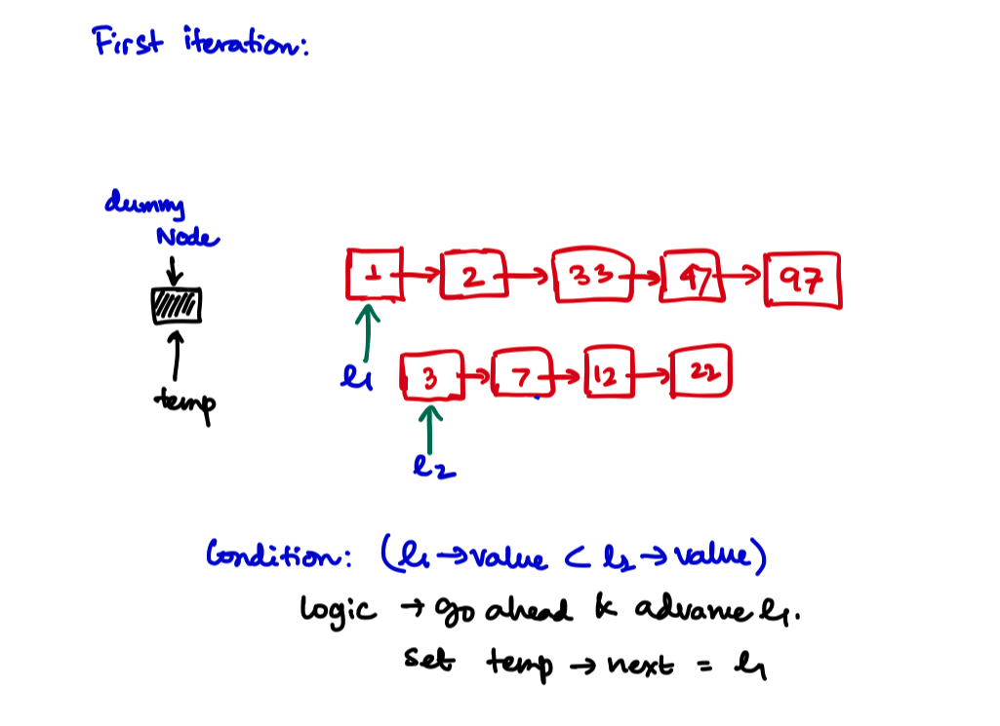
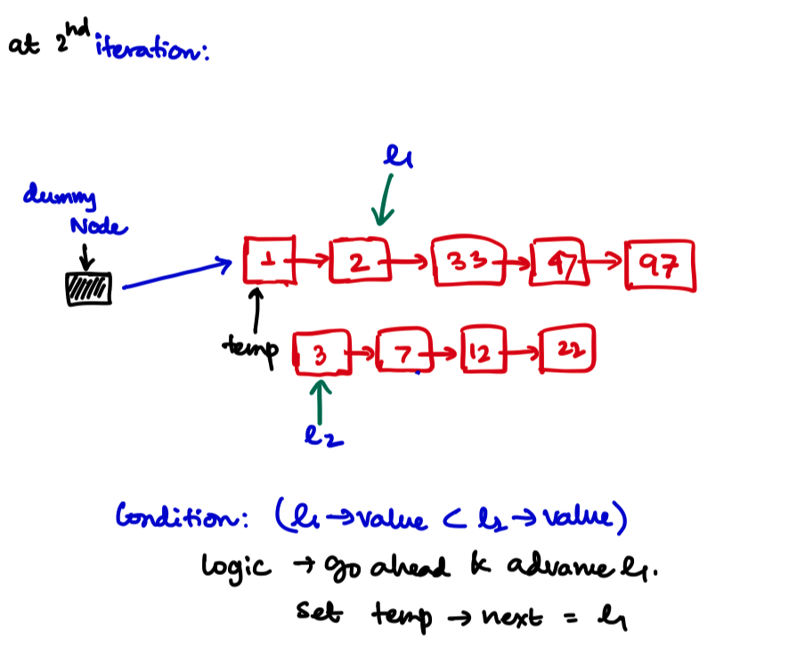
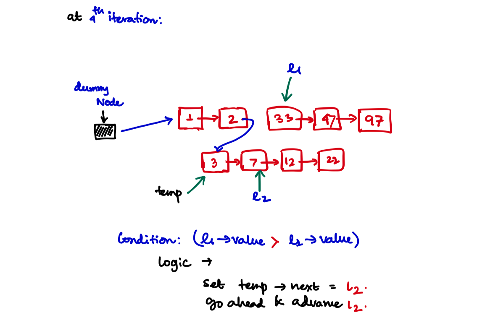
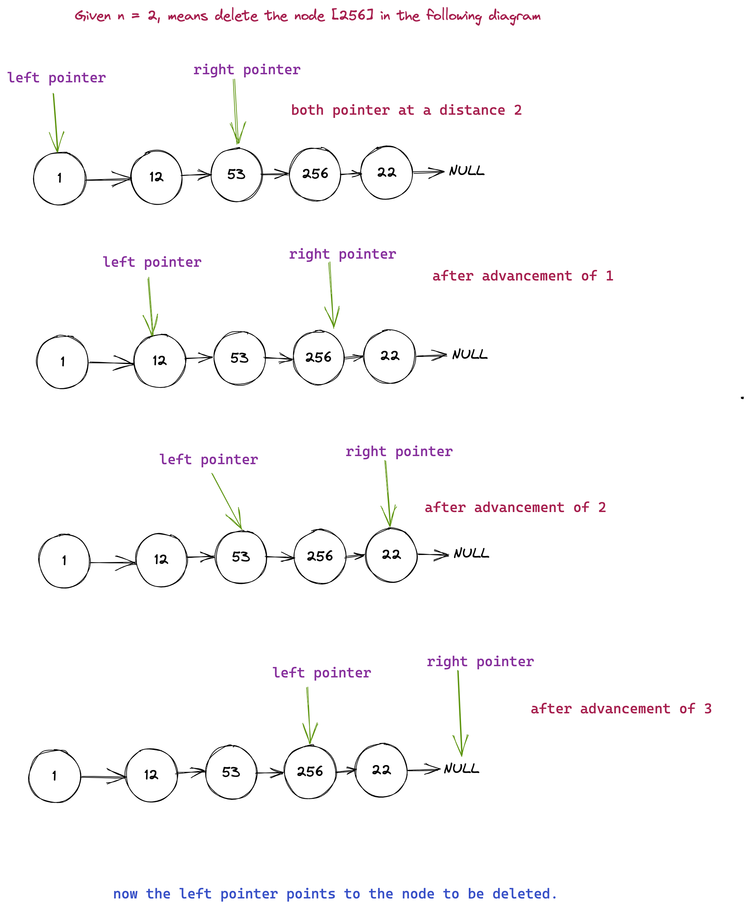
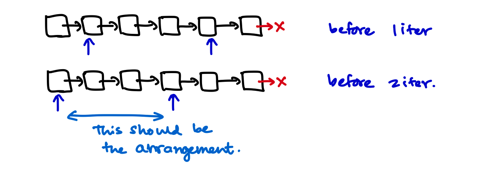
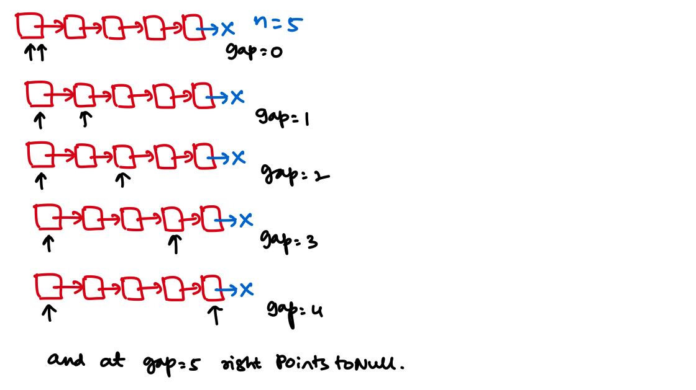
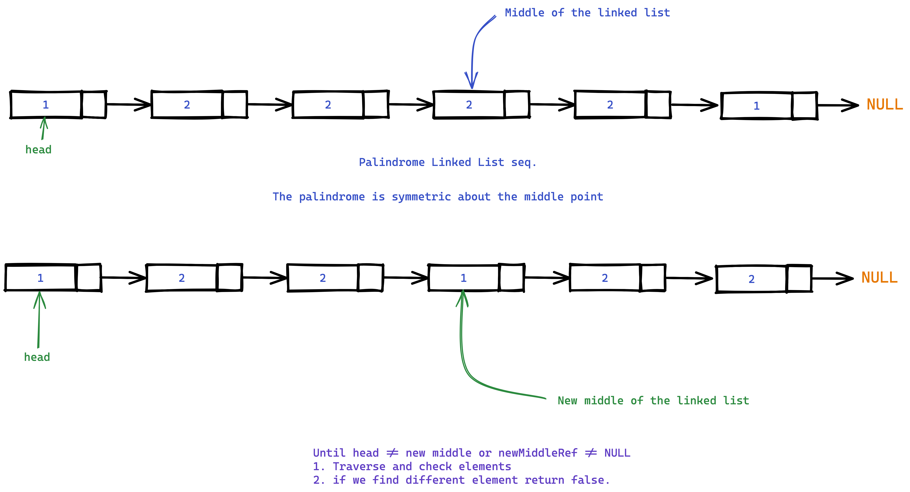

# Linked List problems
## Implement Linked list and write `reverse()`
## Problem Statement
Implement Linked list and write `reverse()` method that reverse the list in-place.

[Find the problem on Leetcode $\to$](https://leetcode.com/problems/reverse-linked-list/)

### Approach
Using variables we'll reverse the list in $O(N)$ time and $O(1)$ space.
### C++ Code for Linked List
```cpp
#include <iostream>

using std::cout;
using std::endl;
using std::vector;

template <class T>
class LinkedListNode {
public:
    T data;
    LinkedListNode<T> *next;
};

template <class T>
class LinkedList {
private:
    LinkedListNode<T> *head;
    LinkedListNode<T> *end;
    int classPriveSize;

public:
    LinkedList() {
        head = NULL;
        end = NULL;
        classPriveSize = 0;
    }

    ~LinkedList() {
        Clear();
    }

    void push_back(T value) {
        if (classPriveSize == 0) {
            LinkedListNode<T> *newNode = new LinkedListNode<T>;
            newNode->data = value;
            newNode->next = NULL;
            head = newNode;
            end = newNode;
        } else {
            LinkedListNode<T> *newNode = new LinkedListNode<T>;
            newNode->data = value;
            newNode->next = NULL;
            end->next = newNode;
            end = newNode;
        }
        classPriveSize++;
    }

    T front() {
        return head->data;
    }

    T back() {
        return end->data;
    }
};
```

### `linkedlist_reverse()` method
We'll implement `linkedlist_reverse()` method to reverse a linked list. For doubly linked lists reverse is easy.

For doubly linked lists reverse is essentially these 2 steps:
- Set `list.end()` as the new `list.begin()`
- Set `list.begin()` as the new `list.end()`.

Let's implement this for a singly linked list.
```cpp
/**
 * Definition for singly-linked list.
 * struct ListNode {
 *     int val;
 *     ListNode *next;
 *     ListNode() : val(0), next(nullptr) {}
 *     ListNode(int x) : val(x), next(nullptr) {}
 *     ListNode(int x, ListNode *next) : val(x), next(next) {}
 * };
 */

class Solution {
public:
    ListNode* reverseList(ListNode* head) {
        ListNode* prev = NULL;
        
        while(head != NULL){
            ListNode* next = head->next;
            head->next = prev;
            prev = head;
            head = next;
        }
        
        return prev;
    }
};
```
---
## Middle of the Linked List
### Problem Statement
Given the head of a singly linked list, return the middle node of the linked list.

[Find the problem on Leetcode $\to$](https://leetcode.com/problems/middle-of-the-linked-list/)

### Approach
Use 2 pointers with different speed. Return the slow pointer.
```cpp
/**
 * Definition for singly-linked list.
 * struct ListNode {
 *     int val;
 *     ListNode *next;
 *     ListNode() : val(0), next(nullptr) {}
 *     ListNode(int x) : val(x), next(nullptr) {}
 *     ListNode(int x, ListNode *next) : val(x), next(next) {}
 * };
 */

class Solution {
public:
    ListNode* middleNode(ListNode* head) {
        
        if (!head->next){
            return head;
        }
        
        ListNode* slowPointer = head;
        ListNode* fastPointer = head;
        
        while(fastPointer!= NULL && fastPointer->next != NULL){
            slowPointer = slowPointer->next;
            fastPointer = fastPointer->next->next;
        }
        
        return slowPointer;
    }
};
```

Same function implementation but on `std::forward_list<typename>` container.

```cpp
#include <forward_list>
#include <iostream>

using std::cout;
using std::endl;
using std::forward_list;


template <class T>
T findMiddleElement(forward_list<T> *list) {

    // Using 2 pointer approach
    auto slowPointer = list->begin();
    auto fastPointer = list->begin();

    // Update the slowPointer slowly and fastPointer quickly

    while (fastPointer != list->end() && std::next(fastPointer, 1) != list->end()) {
        std::advance(slowPointer, 1);
        std::advance(fastPointer, 2);
    }

    return *slowPointer;
}
```

---

## Merge 2 sorted lists
[Find the problem on Leetcode $\to$](https://leetcode.com/problems/merge-two-sorted-lists/)
### Problem Statement
You are given the heads of two sorted linked lists `list1` and `list2`.

Merge the two lists in a one sorted list. The list should be made by splicing together the nodes of the first two lists.

Return the head of the merged linked list.


```
Input: list1 = [1,2,4], and list2 = [1,3,4]
Output: [1,1,2,3,4,4]
```
### Approach
We'll use the `merge` subroutine from the merge sort in order to merge these two lists. One problem is that the `std::forward_list<typename>` do not have a `push_back()` method. Only have a `push_front()` method. So we need to reverse the list before returning it. Using `std::list<typename>` which is a doubly linked list will give us the sorted linked list instead of the reverse sorted linked list.
### Code
```cpp
#include <forward_list>
#include <iostream>

using std::cout;
using std::endl;
using std::forward_list;

template <class T>
forward_list<T> mergeTwoSortedLists(forward_list<T> *list1, forward_list<T> *list2) {
    forward_list<T> mergeList; // Output linked list O(N) space.

    auto list1_ptr = list1->begin();
    auto list2_ptr = list2->begin();

    while (list1_ptr != list1->end() && list2_ptr != list2->end()) {

        if (*list1_ptr < *list2_ptr) {
            mergeList.push_front(*list1_ptr);
            std::advance(list1_ptr, 1);
        } else if (*list1_ptr > *list2_ptr) {
            mergeList.push_front(*list2_ptr);
            std::advance(list2_ptr, 1);
        } else {
            mergeList.push_front(*list1_ptr);
            std::advance(list1_ptr, 1);
            std::advance(list2_ptr, 1);
        }
    }

    if (list1_ptr == list1->end() && list2_ptr != list2->end()) {
        while (list2_ptr != list2->end()) {
            mergeList.push_front(*list2_ptr);
            std::advance(list2_ptr, 1);
        }
    } else if (list1_ptr != list1->end() && list2_ptr == list2->end()) {
        while (list1_ptr != list1->end()) {
            mergeList.push_front(*list1_ptr);
            std::advance(list1_ptr, 1);
        }
    }

    mergeList.reverse();
    return mergeList;
}
```

### Time and Space complexity
Time complexity is $O(N)$ and space complexity is $O(1)$ with this implementation.

### Implementing this problem in-place
#### Step wise iteration explainer
##### **Iteration 1**

##### **Iteration 2**


##### **Iteration 3**


##### **Iteration 4**

##### **Iteration 5, and so on and the last**


```cpp
/**
 * Definition for singly-linked list.
 * struct ListNode {
 *     int val;
 *     ListNode *next;
 *     ListNode() : val(0), next(nullptr) {}
 *     ListNode(int x) : val(x), next(nullptr) {}
 *     ListNode(int x, ListNode *next) : val(x), next(next) {}
 * };
 */

class Solution {
public:
    ListNode* mergeTwoLists(ListNode* list1, ListNode* list2) {
        
        if (list1 == NULL)
            return list2;
        if (list2 == NULL)
            return list1;
        
        auto* dummyNode = new ListNode();
        auto* temp = dummyNode;
        
        while (list1 && list2){
            if (list1->val < list2->val){
                temp->next = list1;
                list1 = list1->next;
            }else{
                temp->next = list2;
                list2 = list2->next;
            }
            temp = temp->next;
        }
        
        if (list1){
            temp->next = list1;
        }else if (list2){
            temp->next = list2;
        }
        
        return dummyNode->next;
    }
};
```

## Delete Node in a Linked List
[Problem on Leetcode $\to$](https://leetcode.com/problems/delete-node-in-a-linked-list/)
### Problem Statement
Write a function to delete a node in a singly-linked list. You will not be given access to the head of the list, instead you will be given access to the node to be deleted directly.

### Example
Input: For element in [4,5,1,9], we are given the node 5. Remove it from the list.

Output: [4,1,9],

You are given the second node with value 5, the linked list should become 4 -> 1 -> 9 after calling your function.

### Approach
- Copy over the next node's value to this node. Remove the next node in $O(1)$ time and Space.

```cpp
/**
 * Definition for singly-linked list.
 * struct ListNode {
 *     int val;
 *     ListNode *next;
 *     ListNode(int x) : val(x), next(NULL) {}
 * };
 */
class Solution {
public:
    void deleteNode(ListNode* node) {
        ListNode* nextNode = node->next;
        int valueAtNext = nextNode->val;
        
        node->val = valueAtNext;
        ListNode* nextToNextNode = nextNode->next;
        
        node->next = nextToNextNode;
        delete(nextNode);
    }
};
```

---


## Remove Nth Node From End of List
Given the head of a linked list, remove the nth node from the end of the list and return its head

### Example
For elements [1, 2, 3, 4, 5], remove the second node from the last. This will return [1, 2, 3, 5].
Similarly [1] and n = 1 will return []. 

### **Constraints**
Nodes are given either in a `forward_list<typename>` or in a custom linked list which is defined below.
```cpp
/**
 * Definition for singly-linked list.
 * struct ListNode {
 *     int val;
 *     ListNode *next;
 *     ListNode() : val(0), next(nullptr) {}
 *     ListNode(int x) : val(x), next(nullptr) {}
 *     ListNode(int x, ListNode *next) : val(x), next(next) {}
 * };
 */
```
- The number of nodes in the list is $\mathcal{N}$
- 1 <= $\mathcal{N}$ <= 30
- 0 <= `(new ListNode())->val` <= 100
- 1 <= n <= $\mathcal{N}$ [n is within the bounds].

### Approach
#### Implementation with **two pass**
- Find the size of the linked list.
- We need to delete the Kth node from the last, means we need to delete the $(\text{SIZE} - K + 1)^{\text{th}}$ element from the first node (considering index of linked list starts from 1).
- Now delete the $(\text{SIZE} - K + 1)^{\text{th}}$ node from the start with the upper solution.

```cpp
struct ListNode{
    int value;
    ListNode *following;
};


ListNode *removeFromEnd(ListNode*head, int end){
    int size = 0;
    ListNode *start = head;
    while (start){
        start = start->following;
        size++;
    }

    if (size <= 1){
        // This means only one element is there and removing that
        // should return nothing.
        return NULL;
    }

    int indexToRemove = size - end + 1;   // Index starts from 1 in this case

    if (indexToRemove == 1){
        // Return head->following if indexToRemove is the first one.
        return head->following;
    }

    ListNode* prev = head;
    ListNode* current = head->following;  // Mark at the 2nd element

    int indxpos = 2;  // Starting from 2nd element

    while (indxpos != indexToRemove){
        prev = prev->following;
        current = current->following;
        indxpos+=1;
    }

    ListNode* following = current->following;
    prev->following = following;
    return head;
}
```

#### Implementation with **one pass only**
- With $2$ pointers we can easily know what is the $n^{\text{th}}$ node from the back of the list.
- **Observation**: If we make 2 pointers at a distance $n$ with each other. Then we move both one by one until the right pointer points to the end of the list $\to$ then the left pointer points to the $n^{\text{th}}$ node from the last.

#### A bit modification
We have to delete some node. Ideally if we could get a pointer to the previous node, it would be better. Ideally our pointer arrangement should look like this


Now walking backwards the starting arrangement of those pointers should be this way



To make that arrangement we need to traverse through the list like the following


#### Edge Case
There is 2 edgecases here.
1. They ask you to delete the first element [6th last node from the end of a 6 element list].
2. They give you a one element list.

For second case you should add the following check
```cpp
if (head->following == NULL) return NULL;
```

And for the first case let's run the above algorithm and see what happens.



So in this case the size of the linked list is 5 and $N = 5$. So now at `gap = 5` right points to `NULL;`. We could add the check like this:
```cpp
if (right){
    ListNode *ref = left->following;
    left->following = left->following->following;
}else{
    // Delete the first Node, because right points to NULL
    return head->following;
}
```

### C++ Code
```cpp
ListNode *removeFromEndOnePass(ListNode*head, int end){
    
    if (head->following == NULL) return NULL;

    int currentGap = 0;
    ListNode *left = head;
    ListNode *right = head;

    while (currentGap!= end){
        currentGap++;
        right = right->following;
    }

    if (right){
        ListNode *ref = left->following;
        left->following = left->following->following;
        
    }else{
        return head->following;
    }

    return head;
}
```

### Time and space complexity
- For both the solution $O(N)$. But 2 pass solution will take more time.
- Both are cosntant space solution.

## Add Two Numbers Given as LinkedLists
Asked in Amazon, Microsoft, Facebook, Qualcomm.
### **Elsewhere**
1. [Find the Problem on Leetcode $\to$](https://leetcode.com/problems/add-two-numbers/)
2. [Problem on Binary Search $\to$](https://binarysearch.com/problems/Add-Linked-Lists)

### Problem Statement
You are given two non-empty linked lists representing two non-negative integers. The digits are stored in reverse order, and each of their nodes contains a single digit. Add the two numbers and return the sum as a linked list.

You may assume the two numbers do not contain any leading zero, except the number 0 itself.

### Testcase Examples
$l_1 = [2,4,3] \:\&\: l_2 = [5,6,4]$. Corrosponding Output $= [7,0,8]$

### Approach
- Do normal addition from 1st standard and add digit by digit in a new linked list.

### C++ code

```cpp
#include <forward_list>
#include <iostream>

using std::cout;
using std::endl;
using std::forward_list;

forward_list<int> addTwoNumbers(forward_list<int> *number1, forward_list<int> *number2) {
    forward_list<int> result;
    int digit_sum;
    int carryFlag = 0;

    auto n1iter = number1->begin();
    auto n2iter = number2->begin();

    while (n1iter != number1->end() && n2iter != number2->end()) {
        if (carryFlag == 0) {
            digit_sum = 0;
        } else {
            digit_sum = 1;
        }

        digit_sum += (*n1iter + *n2iter);

        if (digit_sum >= 10) {
            carryFlag = 1;
        } else {
            carryFlag = 0;
        }

        result.push_front(digit_sum % 10);
        std::advance(n1iter, 1);
        std::advance(n2iter, 1);
    }

    // While loop broken meaning both are same or any one
    // of the numbers have more digits.

    if (n1iter != number1->end() && n2iter == number2->end()) {
        // Means n2 got finished and n1 remains
        while (n1iter != number2->end()) {
            if (carryFlag == 0) {
                digit_sum = (*n1iter);
            } else {
                digit_sum = (*n1iter) + 1;
            }

            if (digit_sum >= 10) {
                carryFlag = 1;
            } else {
                carryFlag = 0;
            }

            result.push_front(digit_sum % 10);
            std::advance(n1iter, 1);
        }
    } else if (n1iter == number1->end() && n2iter != number2->end()) {
        // Means n1 got finished and n2 remains
        while (n2iter != number2->end()) {
            if (carryFlag == 0) {
                digit_sum = (*n2iter);
            } else {
                digit_sum = (*n2iter) + 1;
            }

            if (digit_sum >= 10) {
                carryFlag = 1;
            } else {
                carryFlag = 0;
            }

            result.push_front(digit_sum % 10);
            std::advance(n2iter, 1);
        }
    }

    if (n1iter == number1->end() && n2iter == number2->end()) {
        // Both got ended, then add 1 from the carry to the result
        if (carryFlag) {
            result.push_front(1);
        }
    }

    return result;
}
```

### C++ code for leetcode with custom definition for singly-linked list

Instead of using the `stl` itself C++ solution on a custom linked list.

```cpp
/**
 * Definition for singly-linked list.
 * struct ListNode {
 *     int val;
 *     ListNode *next;
 *     ListNode() : val(0), next(nullptr) {}
 *     ListNode(int x) : val(x), next(nullptr) {}
 *     ListNode(int x, ListNode *next) : val(x), next(next) {}
 * };
 */
class Solution {
public:
    ListNode* addTwoNumbers(ListNode* l1, ListNode* l2) {
        ListNode* answer = new ListNode(-999999);
        ListNode* temp = answer;
        
        int digitLevelSum;
        int carry = 0;
        
        while(l1 && l2){
            
            digitLevelSum = 0;
            if (carry == 0){
                digitLevelSum = l1->val + l2->val;
            }else{
                digitLevelSum = l1->val + l2->val + 1;
            }
            
            if (digitLevelSum >= 10){
                carry = 1;
            }else{
                carry = 0;
            }
            
            ListNode* digitLevelEntry = new ListNode(digitLevelSum % 10);
            
            temp->next = digitLevelEntry;
            temp = digitLevelEntry;
            
            l1 = l1->next;
            l2 = l2->next;
        }
        
        if (l1 != NULL && l2 == NULL){
            while(l1){
                digitLevelSum = 0;
                
                if (carry == 0){
                    digitLevelSum = l1->val;
                }else{
                    digitLevelSum = l1->val + 1;
                }
                
                if (digitLevelSum >= 10){
                    carry = 1;
                }else{
                    carry = 0;
                }

                ListNode* digitLevelEntry = new ListNode(digitLevelSum % 10);
                
                temp->next = digitLevelEntry;
                temp = digitLevelEntry;
                
                l1 = l1->next;
            }
        } else if (l1 == NULL && l2 != NULL){
            while(l2){
                digitLevelSum = 0;
                
                if (carry == 0){
                    digitLevelSum = l2->val;
                }else{
                    digitLevelSum = l2->val + 1;
                }
                
                if (digitLevelSum >= 10){
                    carry = 1;
                }else{
                    carry = 0;
                }
               
                ListNode* digitLevelEntry = new ListNode(digitLevelSum % 10);
                
                temp->next = digitLevelEntry;
                temp = digitLevelEntry;
                
                l2 = l2->next;
            }
        } 
        
        if (!(l1&&l2)){
            if (carry == 1){
                ListNode* digitLevelEntry = new ListNode(1);
                temp->next = digitLevelEntry; 
            }
        }
        
        return answer->next;
    }
};
```


## Intersection of Two Linked Lists
[Find the problem on Leetcode $\to$](https://leetcode.com/problems/intersection-of-two-linked-lists/)
### Problem Statement
Given the heads of two singly linked-lists `headA` and `headB`, return the node at which the two lists intersect. If the two linked lists have no intersection at all, return `null`.

### Example
For the following problem, head1 and head2 are given, find the marked blue intersection point.


### Approach
#### **Brute Force approach**
- For each element in `list1`, check if the element is in `list2` by comparing the addresses not the values because values can be same in different lists.
- This takes $O(M*N)$ time and no extra space.

#### **Using Hash table**
- As we have to compare if something is present or not we can use hash table to do so.
- If the node is present in both the list means, they must have the same value and the same address.
- First we'll create an `std::unordered_map<long long int, int> dict;`. The key should be `long long int` address of list nodes, and the value should be the value at that address.
- Now for each element in the second list check that `std::unordered_map<long long int, int> dict;` has that value or not. If both the value and the address of the value is present in the second list means this is the first merge point.

#### **C++ Code**

```cpp
class Solution {
public:
    ListNode *getIntersectionNode(ListNode *headA, ListNode *headB) {
        
        // address to value mapping
        std::unordered_map<long long int, int> dict;
        
        // Iterate and Add all the entries of listA
        auto listAiterator = headA;
        while(listAiterator){
            
            // Convert the address to a long long int
            // This is the virtual address only, NOT the physical address.
            long long int address = reinterpret_cast<long long int>(listAiterator);
            
            dict.insert(make_pair(address, listAiterator->val));
            listAiterator = listAiterator->next;
        }
        
        // Now for all element see if the address is already in the map?
        // If it's in the map means this is the merge point.
        auto listBiterator = headB;
        
        while(listBiterator){

            // cast the address to a long long int
            long long int address = reinterpret_cast<long long int>(listBiterator);
            auto search = dict.find(address);
            
            if (search != dict.end()){
                break;
            } else {
                listBiterator = listBiterator->next;
            }
        }
        
        if (listBiterator){
            return listBiterator;
        }
        
        return NULL;
    }
};
```
#### Time and Space Complexity
- As we are going through the list once so the time is $O(M + N)$ where $M$ and $N$ are length of the lists.
- Additional $O(M)$ or $O(N)$ space is required whatever you choose to store first.

### Linear time and Constant Space Approach
- **Now check what is the problem here?** Here we don't know how long after the merge point occurs. Both the lists can be of any size so we can't compare them directly and advance. **But** what if we resolve the difference and synchronize them with each other? Let's see what I mean:


### C++ Code for Most Optimal Approach
```cpp
class Solution {
public:
    ListNode *getIntersectionNode(ListNode *headA, ListNode *headB) {
        int sizeA = 0;
        int sizeB = 0;
        
        // O(max(m, n))
        ListNode* Aptr = headA;
        ListNode* Bptr = headB;
        
        
        while(Aptr || Bptr){
            if (Aptr){
                sizeA++;
                Aptr = Aptr->next;
            }
            if (Bptr){
                sizeB++;
                Bptr = Bptr->next;
            }
        }
        
        int headerDifference = sizeA - sizeB;
        
        if (headerDifference < 0){
            // Size B is higher
            // So advance B upto headerDifference
            while (headerDifference!=0){
                headB = headB->next;
                headerDifference++;
            }
        } else {
            // Size A is higher
            // So advance A upto headerDifference
            while (headerDifference!=0){
                headA = headA->next;
                headerDifference--;
            }
        }
        
        while(headA && headB){
            if (headA == headB){
                return headA;
            }else{
                headA = headA->next;
                headB = headB->next;
            }
        }
        
        return NULL;
    }
};
```

#### Time and Space Complexity
- The size calculation take $O(M)$ where $M$ is the size of the bigger list, and last while loop runs $O(N)$ where $N$ is the size of the smaller list. So overall $O(M+N)$ is the time complexity.
- No extra space required.

## Detect a cycle in linked list
### Problem Statement
Given head, the head of a linked list, determine if the linked list has a cycle in it.
### Approach
- Create 2 pointers and then move ahead,
- slow pointer will move one step up,
- fast pointer will move twos step up,
- if fast pointer reaches `NULL` somehow, this means there is no cycle in linked list.
- If that does not happens and some time after `fast == slow`, means there is a cycle in linked list. Return `true`.
### C++ Code
```cpp
class Solution {
public:
    bool hasCycle(ListNode *head) {
        
        ListNode* slow = head;
        ListNode* fast = head;
        
        while (fast && fast->next && fast->next->next){
            slow = slow->next;
            fast = fast->next->next;
            
            if(slow == fast){
                return true;
            }
            
        }
        
        return false;
    }
};
```

#### Time and space complexity
- $O(N)$ time and no extra space.

## Palindrome Linked list
### Problem Statement
Given the head of a singly linked list, return true if it is a palindrome.

### Approach **With More Space**
- First we push all the value to a new stack.
- Then we pop the value and compare it to the list head. If same we move forward and if not we return `false`.

#### C++ Code
```cpp
class Solution {
public:
    bool isPalindrome(ListNode* head) {
        
        if (head == NULL or head->next == NULL) return true;
        
        vector<int> stk;
        
        ListNode* headIterator = head;
        
        while(headIterator){
            stk.push_back(headIterator->val);
            headIterator = headIterator->next;
        }
        
        ListNode* headIterator2 = head;
        
        while(stk.size() != 0 and headIterator2){
            if (stk.back() != headIterator2->val){
                return false;
            }
            
            headIterator2 = headIterator2->next;
            stk.pop_back();
        }
        
        return true;
    }
};
```

### More optimized approach
- Break down the linked list into 2 parts by finding the middle.
- From the middle element reverse the linked list.
- Now again find the middle of the linked list, and then from head go ahead comparing with middle element and move forward. If you find any element which is not equal return `false`.



```cpp
class Solution {
private:
    ListNode* reverseSubRoutine(ListNode *head){
        ListNode* current = head;
        
        ListNode* prev = NULL;
        
        while(current){
            ListNode *nextToCurrent = current->next;
            current->next = prev;
            prev = current;
            current = nextToCurrent;
        }
        
        return prev;
    }
    
    ListNode *findMidPoint(ListNode* head){
        ListNode *slow = head;
        ListNode *fast = head;
        
        while(fast and fast->next){
            slow = slow->next;
            fast = fast->next->next;
        }
        
        return slow;
    }
    
    int listSize(ListNode *head){
        int sz = 0;
        ListNode*i_ptr = head;
        
        while(i_ptr){
            i_ptr = i_ptr->next;
            sz++;
        }
        
        return sz;
    }

public:
    bool isPalindrome(ListNode* head) {
        
        if (head == NULL or head->next == NULL) return true;
        
        ListNode *midpoint = findMidPoint(head);
        
        // Reverse from mid point
        ListNode *reversedHead = reverseSubRoutine(midpoint);
        
        ListNode *traverse = head;
        while(traverse->next != midpoint){
            traverse = traverse->next;
        }
        
        traverse->next = reversedHead;
        
        // Now the thing is reversed.
        // Now get the length of the list
        
        int size = listSize(head);
        
        if (size % 2 != 0){
            // The list is not even length means there is one random element at the middle
            ListNode *newMidPoint = findMidPoint(head);
            ListNode *traveler = newMidPoint;
            
            while(traveler->next){
                if (head->val != traveler->val){
                    return false;
                }
                traveler = traveler->next;
                head = head->next;
            }
        } else {
            // The list is even length.
            ListNode *newMidPoint = findMidPoint(head);
            ListNode *traveler = newMidPoint;
            
            while(traveler){
                if (head->val != traveler->val){
                    return false;
                }
                traveler = traveler->next;
                head = head->next;
            }
        }
        return true;
    }
};
```
## Reverse Nodes in k-Group
### Problem Statement
Given the head of a linked list, reverse the nodes of the list k at a time, and return the modified list.

k is a positive integer and is less than or equal to the length of the linked list. If the number of nodes is not a multiple of k then left-out nodes, in the end, should remain as it is.

You may not alter the values in the list's nodes, only nodes themselves may be changed.