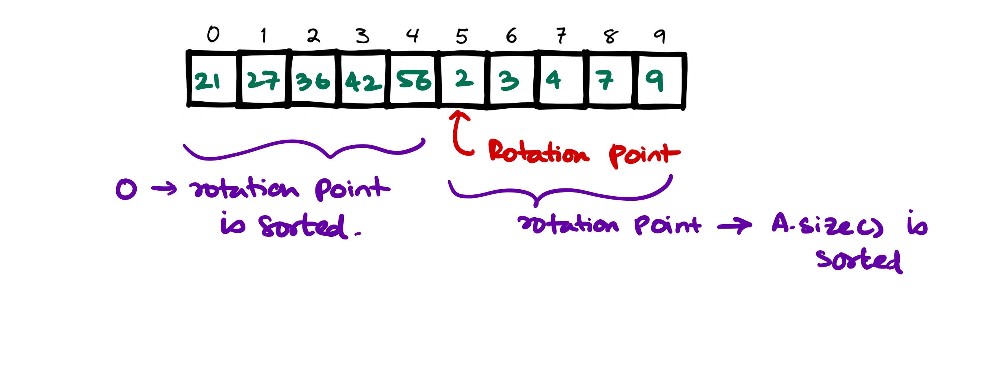

# :material-cloud-search: Binary Search problems
Binary search problems are really useful because they run in sublinear time. We'll be solving the following problems in order to master this

## Binary Search implementation in C++
Binary search is really easy to implement. Main goal is to divide the search space into 2 partitions (`bi`) and then based on the criteria search only in one partition.

### Expected time complexity
Expected time complexity is $O(\log N)$ where N is the number of elements in the array.

### Code implementation
```cpp
// Return the index of the element in the array
// using binary search

int binary_search(std::vector<int> &v, int target) {
    int start = 0;
    int end = v.size() - 1;

    int middle = (end + start) / 2;
    int index = -1; // return -1 if not found

    while (start <= end) {
        if (v[middle] < target) {
            start = middle + 1;
        } else if (v[middle] > target) {
            end = middle - 1;
        } else {
            return middle;
        }

        middle = (end + start) / 2;
    }

    return index;
}
```

## Binary Search on Reverse Sorted Array
We've seen the binary search algorithm for a sorted array, but if the array is reverse sorted then we can easily modify the binary search algorithm here `else if (v[middle] > target) { start = middle + 1; }` because the target element is lower and the array is reverse sorted so the required element should be at the end partition of the array.

So a little modification of the binary search algorithm is sufficient to solve the problem.

## Order agnostic search
If the array is sorted but we don't know the order of the elements whether it is ascending or descending? Then what we can do is the following

### Approach
- See if the array size is 1 or not then we return.
- If the array size is more than 1, then find if $\text{A[0]} > \text{A[1]}$ or not? If it is then the array is reverse sorted. If that is not the case then the array is sorted in ascending order.
- We run the previous or previous to previous algorithm accordingly.

## First and Last occurrence of an Element
In a sorted array if we have more than one element we may want to know what is the first occurrence of some element (assuming they exists).

### Approach
- We can use linear search but there is no fun in that. Instead we use a binary search, but how we'll do this?
- Let's employ a binary search subroutine, now this will find any occurrence of the **target** element,
- Now if this is not the first occurrence of the **target** element we will need to search the left subsection of the array, and in case we didn't find any we record this occurence as the first occurrence of the **target** element so far,
- Now we search for the **target** element again in the left subsection of the array by modifying `end = middle - 1`

### Code
```cpp
int firstOccurence(vector<int> &v, int target){
	int start = 0;
	int end = v.size() - 1;

	int middle = start + (end - start) / 2;
	int first = -1;

	while (start <= end) {

		if (v[middle] == target) {
            // modification to the general binary search
			first = middle;
			end = middle - 1;
		} else if (v[middle] < target) {
			start = middle + 1;
		} else {
			end = middle - 1;
		}

		middle = start + (end - start) / 2;
        
	}

	return first;
}
```

!!! danger "For finding the last occurence"
    Similarly we can find the last occurence of an element in the sorted array by modifying the previous problem slightly, by first finding the element with binary search, then instead of finding the element in the left side [for first occurence] we search the right sub array for the last occurence of the element.

    ```cpp
    int lastOccurence(vector<int> &v, int target){
        int start = 0;
        int end = v.size() - 1;

        int middle = start + (end - start) / 2;
        int last = -1;

        while (start <= end) {

            if (v[middle] == target) {
                // modification to the general binary search
                last = middle;
                start = middle + 1; // look in the right subarray for the last occurrence
            } else if (v[middle] < target) {
                start = middle + 1;
            } else {
                end = middle - 1;
            }

            middle = start + (end - start) / 2;

        }

        return last;
    }
    ```


## Count of an Element in a Sorted Array

[Similar problem on Leetcode $\to$](https://leetcode.com/problems/find-minimum-in-rotated-sorted-array/)

This is a very simple problem, we can find the first occurrence of an element [index] and last occurence of an element and subtract. This will return the number of times the element was found in the array.

### Expected Time complexity
$O(\text{lg} N)$ for finding the first occurrence and $O(\text{lg} N)$ for finding the last occurrence. Total of $O(\text{lg} N)$.

## Number of Times a Sorted array is Rotated
### Problem Statement
An asending sorted array $A[0 \to N]$ once rotated becomes $A[1 \to N] + A[0]$. When it twice rotated becomes $A[2 \to N] + A[0 \to 1]$.

When the array is rotated $k$ times, the array becomes $A[K \to N] + A[0 \to K - 1]$


### Brute Force Approach
Using a linear search if we find for some $i$ $A[i] > A[i+1]$, that $i$ is the index of the rotation starting point. Subtract $i$ from length of the array to find how much rotation took place. 

One more thing we can observe is that the $(\text{size - index of the minimum element})$ is the # of rotations done on the sorted array. Both of these solution is $O(N)$ so not efficient enough.

### More optimized approach
We cannot afford to search for the minimum element in the entire array, this will cost $O(N)$ time. However if we reduce the size of the search space we can reduce the time complexity of the algorithm.

This apporach works like this:

1. First check the middle $i$, if the value is smaller than both the element to its side $i - 1$ and $i + 1$, then it is the point of the minimum element means this is the point of rotation.
2. If this is not true then based on some idea we should reduce the size of the search space, otherwise its gonna be $O(N)$
      1. We do this very ingenious way, first we check if the middle element is smaller than the first element or not? If this is the case then the minimum element is present in the left side of the middle element.
      2. Else the element should be present in the right side of the middle element.

### Code
```cpp
class Solution {
public:
    int findMin(vector<int>& nums) {
        int start = 0;
        int end = nums.size() - 1;
        
        int size = nums.size();

        int middle = start + (end - start) / 2;
        
        while (start < end){
            
            if (nums[middle] > nums[end]) {
                start = middle + 1;
            } else {
                end = middle;
            }
            
            middle = start + (end - start) / 2;
        }
        
        return size - start + 1;
    }
};
```

## Find an Element in a Rotated Sorted Array
[Problem on Leetcode $\to$](https://leetcode.com/problems/search-in-rotated-sorted-array/)
### Approach
- If we look at the previous problem, we'll see that the (rotation point): let's call that the pivot, the subarray before pivot is sorted and subarray after pivot is sorted as well.
- If we run 2 binary search on each of the subarrays we'll find the target element in $O(\text{lg} N)$ time.



### Code
```cpp
class Solution {
private:
    int findRotationPoint(vector<int> &nums) {
        int start = 0;
        int end = nums.size() - 1;
        
        // base cases:
        if (nums.size() <= 1) return 0; // zero or one element array do not have rotations
        if (nums[start] < nums[end]) return 0;  // no rotation at all
        
        int middle = start + (end - start) / 2;
        
        while (start < end) {
            
            if (nums[middle] > nums[end]) {
                // means rotation point is right of mid
                start = middle + 1;
            } else {
                end = middle;
            }
            
            middle = start + (end - start) / 2;
        }
        
        return start;
    }
    
    int binary_search(vector<int> &nums, int start, int end, int target) {

        int mid = start + (end - start) / 2;
        
        while (start <= end) {
            if (nums[mid] == target) return mid;
            if (nums[mid] < target) start = mid + 1;
            if (nums[mid] > target) end = mid - 1;
            
            mid = start + (end - start) / 2;
        }
        
        return -1;
    }
    
public:
    int search(vector<int>& nums, int target) {
        
        if (nums.size() == 1) {
            if (nums[0] == target) return 0;
            else return -1;
        }
        
        int rotationPoint = findRotationPoint(nums);
        
        // the array is sorted from 0 -> rotationPoint - 1
        // and rotationPoint -> nums.size() - 1
        
        int left = binary_search(nums, 0, rotationPoint - 1, target);
        int right = binary_search(nums, rotationPoint, nums.size() - 1, target);

        return std::max(left, right);
    }
};
```

### Time Complexity
To find the rotation point we make $O(\lg N)$ comparisons and to do binary searchs on both the left and right takes $O(\lg N)$ time. So total time complexity is $O(\lg N)$.

## Search Insert Position

[Problem on Leetcode $\to$](https://leetcode.com/problems/search-insert-position/)

!!! WARNING important
    #### **Finding Floor and Ceil of an element in a Sorted Array**
    This is a very important idea we need to understand before you attempt this question. We need to run the binary search algorithm and see where the start and end stops after the execution. Do it yourself, and put it in the comments below. Do a dry run on the binary search algorithm and see what are the start and end points to after the execution finishes. **I'll add a video for this later**.

Given a sorted array of distinct integers and a target value, return the index if the target is found. If not, return the index where it would be if it were inserted in order.

The algorithm must run with $O(\lg n)$ complexity.

### Approach
We can employ the normal binary search algorithm, and instead of returning -1 if we don't find the target number, we'll carefully look what all the pointers are pointing towards at the end of the binary search algorithm.

If we look carefully we'll find that at the end of the binary search if there is no element present in the array, the pointer $\text{start}$ and $\text{end} - 1$ points to the insertion point for that element.

### Careful Dry run with an example


### Code
```cpp
class Solution {
public:
    int searchInsert(vector<int>& nums, int target) {
        int start = 0;
        int end = nums.size() - 1;
        
        int middle = start + (end - start) / 2;
        
        while (start <= end) {
            if (nums[middle] == target) return middle;
            if (nums[middle] > target) {
                end = middle - 1;
            } else if (nums[middle] < target) {
                start = middle + 1;
            }
            
            middle = start + (end - start) / 2;
        }
        
        // send back start or end - 1 instead of -1.
        return start;
    }
};
```
## Single Element in a Sorted Array

[Problem on Leetcode $\to$](https://leetcode.com/problems/single-element-in-a-sorted-array/)

### Problem Statement
You are given a sorted array consisting of only integers where every element appears exactly twice, except for one element which appears exactly once. Return the single element that appears only once.

Your solution must run in $O(\lg n)$ time and $O(1)$ space.

### Approach
- As the solution is required to be run in $O(1)$ space and $O(\lg n)$ time it means we have to use binary search.
- Now we run the default binary search algorithm with some modification. We go to the middle element, now question arises based on what should we **divide the array** and **only** solve on one of those two part?
- If you look closely at the array, you will notice that for each pair in the left side of the **odd one out** `<int, int>` the index is like this `<even, odd>` and for each pairs in the right side of the **odd one out** the index is like this `<odd, even>`.
- We identify how the indexes are aranged and we jump to solve a smaller subproblem.

### Code
```cpp
class Solution {
public:
    int singleNonDuplicate(vector<int>& nums) {
        
        // if the size is 1 then it is the odd one out
        if (nums.size() == 1) return nums[0];
        
        // boundary cases:
        if (nums[0] != nums[1]) return nums[0];
        if (nums[nums.size() - 1] != nums[nums.size() - 2]) return nums[nums.size() - 1];
        
        
        int start = 0;
        int end = nums.size() - 1;
        
        int middle = start + (end - start) / 2;
        
        while (start <= end) {
            int atMid = nums[middle];
            if (atMid != nums[middle - 1] and atMid != nums[middle + 1]) {
                // case where the middle element is the odd one out
                return atMid;
            }
            
            // check if the odd one out is the left or right sub part
            
            // case 1:
            // [1, 1, ..., 2, 2, ...]
            //             | middle
            if (nums[middle] == nums[middle + 1]) {
                // now check if middle is even and middle + 1 is odd?
                // if this is true then odd one out is in the right subarray
                if (middle % 2 == 0) {
                    start = middle + 1;
                } else {
                    end = middle - 1;
                }
            }
            
            // case 2:
            // [1, 1, ..., 2, 2, ...]
            //                | middle
            if(nums[middle] == nums[middle - 1]) {
                // now check if middle is odd and middle - 1 is even?
                if (middle % 2 != 0) {
                    start = middle + 1;
                } else {
                    end = middle - 1;
                }
            }
            
            middle = start + (end - start) / 2;
        }
        
        return -1;
    }
};
```

## Minimum Difference Element in a Sorted Array
### Problem Statement
Given an array of numbers sorted in ascending order, find the element in the array that has the minimum difference with the given ‘key’.

### Examples
```
Input: [4, 6, 10], key = 7
Output: 6
Explanation: The difference between the key '7' and '6' is minimum than any other number in the array.
```
```
Input: [4, 6, 10], key = 4
Output: 4
```
```
Input: [1, 3, 8, 10, 15], key = 12
Output: 10
```
```
Input: [4, 6, 10], key = 17
Output: 10
```

### Approach
- If the element is present in the array, we should return it.
- If not present, then
    - We should check the ceil and floor of the element from the array.
    - Floor is the end pointer when the binary search is finished and ceil would be `end + 1` pointer because the array is sorted.
    - Next we should check what is lower difference between floor and target or ceil or target, which ever is lower that is closer to target.

### C++ Code Solution
```cpp
int minDiffElement(vector<int> &v, int target) {
    int start = 0;
    int end = v.size() - 1;

    int middle = start + (end - start) / 2;

    while (start <= end) {
        if (v[middle] == target) return target;
        if (v[middle] < target) start = middle + 1;
        if (v[middle] > target) end = middle - 1;

        middle = start + (end - start) / 2;
    }

    // lowerbound = at index end
    int diFFWithLowerBound = std::abs(target - v[end]);
    int diFFWithUpperBound = std::abs(v[end+1] - target);

    if (diFFWithLowerBound > diFFWithUpperBound) return v[end + 1];
    if (diFFWithLowerBound < diFFWithUpperBound) return v[end];

    return -1; // both are same distant
}
```

### Time and space complexity
No extra space is required, so $O(1)$ space and total of $O(\lg n)$ time is required for binary search.

## Search in a sorted matrix
[Similar Problem on Leetcode $\to$](https://leetcode.com/problems/search-a-2d-matrix/)

### Problem Statement
Write an efficient algorithm that searches for a value target in an $M \times N$ integer matrix `matrix`. This matrix has the following properties:

1. Integers in each row are sorted from left to right.
2. The first integer of each row is greater than the last integer of the previous row. Also can be termed as **inter-row-wise sorted**.

### Example
**Matrix**: 
$M_A = \begin{bmatrix}
1 & 3 & 5 & 7 \\
10 & 11 & 16 & 20 \\
23 & 30 & 34 & 60 
\end{bmatrix}$

```
Input = MA and target = 3
Output: true
```

## Search in a sorted matrix but not `inter-row-wise` sorted
### Problem Statement
The problem statement is almost identical similar but the rule _first integer of each row is greater than the last integer of the previous row_ does **NOT** apply here.

### Example
**Matrix**: 
$M_B = \begin{bmatrix}
1 & 3 & 5 & 7 \\
2 & 4 & 64 & 20 \\
3 & 5 & 134 & 60 
\end{bmatrix}$

```
Input = MB and target = 3
Output: true
```

## Next alphabetical element
## Find position of an element in an Infinite Sorted Array
## Index of First 1 in a Binary Sorted Infinite Array
## Binary Search on Answer Concept
## Peak Element
## Find maximum element in Bitonic Array
## Search An Element in Bitonic Array
## Allocate minimum number of pages