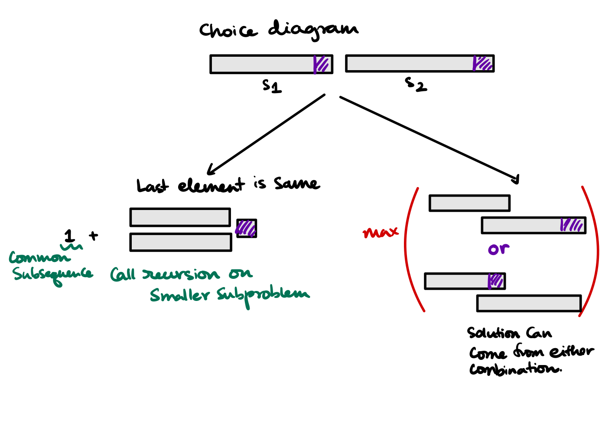

# DP on strings
We'll discuss few DP on strings problem here, starting with the Longest Common 🗿 pattern. Then we'll move on to Edit distance and other similar basic and advanced DP on string problems.

**Problems** discussed

1. [Longest Common Subsequence](#longest-common-subsequence)
1. [Printing the Longest Common Subsequence](#printing-the-longest-common-subsequence)
1. [Longest common substring](#longest-common-substring)
1. [Longest palindromic sequence](#longest-palindromic-sequence)
1. [Minimum number of deletion in a string to make it a palindrome](#minimum-number-of-deletion-in-a-string-to-make-it-a-palindrome)
1. [Shortest Common Supersequence (Print)](#shortest-common-supersequence-print)
1. [Longest Repeating Subsequence](#longest-repeating-subsequence)
1. [Wildcard Matching](#wildcard-matching)
1. [Minimum Insertion Steps to Make a String Palindrome](#minimum-insertion-steps-to-make-a-string-palindrome)


## Longest Common Subsequence
Find the problem on [Leetcode $\to$](https://leetcode.com/problems/longest-common-subsequence/description/)
### Problem Statement
Given two strings `text1` and `text2`, return the length of their longest common subsequence. If there is no common subsequence, return `0`.

A subsequence of a string is a new string generated from the original string with some characters (can be none) deleted without changing the relative order of the remaining characters.

- For example, "ace" is a subsequence of "abcde".

A common subsequence of two strings is a subsequence that is common to both strings.

### Examples
```
Input: text1 = "abcde", text2 = "ace" 
Output: 3  
Explanation: The longest common subsequence is "ace" and its length is 3.
---

Input: text1 = "abc", text2 = "abc"
Output: 3
Explanation: The longest common subsequence is "abc" and its length is 3.
---

Input: text1 = "abc", text2 = "def"
Output: 0
Explanation: There is no such common subsequence, so the result is 0.
```

### Approach
- We formalize an approach to the solution for a DP problem into the following three steps
    - Find the base case (smallest viable input),
    - write the choice diagram, write the recursion for that choice diagram
    - memoize this recursion,
    - write bottom up approach solving the recursion.
- Here the base case is for a string with size $=0$. Hence we add the first condition for the recursion solution $= 0$ if $S_1 \text{.length or } S_2 \text{.length} = 0$. For this case the output is 0.
- Now following is the choice diagram



For this choice diagram we write the recursion and memoize it (see in code below).

### Code
```cpp
class Solution {
private:
    vector<vector<int>> dp;
    int subroutine(int n1, int n2, string &text1, string &text2) {
        if (n1 <= -1 or n2 <= -1) {
            return 0;
        }
        
        // base case
        if (dp[n1][n2] != -1) return dp[n1][n2];

        if (text1[n1] == text2[n2]) {
            return dp[n1][n2] = 1 + subroutine(n1-1, n2-1, text1, text2);
        }
        
        return dp[n1][n2] = std::max(
            subroutine(n1 - 1, n2, text1, text2),
            subroutine(n1, n2 - 1, text1, text2)
        );
    }

public:
    int longestCommonSubsequence(string text1, string text2) {
        dp = vector<vector<int>>(text1.size(), vector<int>(text2.size(), -1));
        return subroutine(text1.size() - 1, text2.size() - 1, text1, text2);
    }
};
```

**Converting** the code into a iterative DP approach

```cpp
class Solution {
public:
    vector<vector<int>> dp;

    int longestCommonSubsequence(string text1, string text2) {
        dp = vector<vector<int>>(text1.size() + 1, vector<int>(text2.size() + 1, 0));
        
        int n1 = text1.size();
        int n2 = text2.size();

        for (int i = 1; i <= n1; i++) {
            for (int j = 1; j <= n2; j++) {
                if (text1[i - 1] == text2[j - 1]) {
                    dp[i][j] = 1 + dp[i - 1][j - 1];
                } else {
                    dp[i][j] = std::max(dp[i - 1][j], dp[i][j - 1]);
                }
            }
        }

        return dp[n1][n2];
    }
};
```

## Printing the Longest Common Subsequence
Find the problem on [Coding Ninjas $\to$](https://www.codingninjas.com/studio/problems/print-longest-common-subsequence_8416383?leftPanelTab=1)
### Problem Statement
Same as above, but instead of the length we need the actual subsequence $(\textsf{LCS})$ as the output.
### Approach
- We know that output of $\textsf{LCS}$ is stored at $dp[n][m]$ if $n, m = \textsf{size}(S_1), \textsf{size}(S_2)$.
- We reach to $dp[n][m]$ by two ways
    - If $S_1[n] = S_2[m]$ then from $dp[n - 1][m- 1]$, that is $dp[n][m] = 1 + dp[n - 1][m- 1]$.
    - Otherwise we come from $max(dp[n -1][m], dp[n][m-1])$.
- We'll do a backtracking from $dp[n][m]$ to $dp[1][1]$ and add the characters whenever we encounter same characters in $S_1, S_2$.
- This is the way we build the `reverse` of $\textsf{LCS}$ string.
- We reverse the string and return.
### Code
```cpp
#include <string.h>
#include <iostream>

using namespace std;

string findLCS(int n, int m,string &s1, string &s2){
	n = s1.size();
	m = s2.size();

	int dp[n + 1][m + 1];
	memset(dp, 0, sizeof(dp));

	// build the dp table
	for (int i = 1; i <= n; i++) {
		for (int j = 1; j <= m; j++) {
			if (s1[i - 1] == s2[j - 1]) {
				dp[i][j] = 1 + dp[i - 1][j - 1];
			} else {
				dp[i][j] = std::max(dp[i-1][j], dp[i][j-1]);
			}
		}
	}

	// now do backtrack
	string LCS = "";
	int i = n;
	int j = m;

	while (i > 0 and j > 0) {
		if (s1[i - 1] == s2[j - 1]) {
			LCS += s1[i - 1];
			i--; j--;
		} else {
			if (dp[i - 1][j] > dp[i][j - 1]) {
				i--;
			} else {
				j--;
			}
		}
	}

	std::reverse(LCS.begin(), LCS.end());

	return LCS;
}
```

### Optimization to reduce space

If the question is asked to fetch the lenght of the longest common subsequences, then we do not need to maintain the entire DP table. Seen in this [leetcode problem](https://leetcode.com/problems/longest-common-subsequence/description/) we reduce the usage of $O(N^2)$ table into $2 * O(N)$ tables.

```cpp
class Solution {
public:
    int longestCommonSubsequence(string text1, string text2) {
        string a = text1;
        string b = text2;

        int n = a.size();
        int m = b.size();

        vector<int> current(m + 1, 0);
        vector<int> prev(m + 1, 0);

        for (int i = 1; i <= n; i++) {
            for (int j = 1; j <= m; j++) {
                if (a[i-1] == b[j - 1]) {
                    current[j] = 1 + prev[j - 1];
                } else {
                    current[j] = std::max(
                        prev[j], current[j - 1]
                    );
                }
            }

            prev = current;
        }

        return prev[m];
    }
};
```

## Longest common substring
Find the problem on [GeeksForGeeks $\to$](https://practice.geeksforgeeks.org/problems/longest-common-substring1452/1)
### Problem Statement
Given two strings. The task is to find the length of the longest common substring. 

**Examples**
```
Input: S1 = "ABCDGH", S2 = "ACDGHR", n = 6, m = 6
Output: 4
Explanation: The longest common substring
is "CDGH" which has length 4.
---

Input: S1 = "ABC", S2 "ACB", n = 3, m = 3
Output: 1
Explanation: The longest common substrings
are "A", "B", "C" all having length 1.
```

### Approach
- The main difference from the last problem is that here we need to consider a _continuous_ substring.
- We define $dp[i][j]$ as same of length of $S_1[1 \dots i], S_2[1 \dots j]$. If $S_1[1 \dots i] \neq S_2[1 \dots j]$ then the common substring size we set to $0$. 
- We record every step if we find the biggest substring so far.

### Code
```cpp
class Solution {
public:
    int longestCommonSubstr (string S1, string S2, int n, int m) {
        int dp[n + 1][m + 1];
        memset(dp, 0, sizeof(dp));
        
        int maxLength = 0;
        
        for (int i = 1; i <= n; i++) {
            for (int j = 1; j <= m; j++) {
                if (S1[i - 1] == S2[j - 1]) {
                    dp[i][j] = dp[i - 1][j - 1] + 1;
                    maxLength = std::max(maxLength, dp[i][j]);
                }
                /* else { dp[i][j] = 0; }
                 * if we don't see same element we reset the dp[i][j] = 0;
                 * but it is already 0 via memset.
                 */
            }
        }
        
        return maxLength;
    }
};
```
## Longest palindromic sequence
### Problem Statement
Given a string s, find the longest palindromic subsequence's length in s.

A **subsequence** is a sequence that can be derived from another sequence by deleting some or no elements without changing the order of the remaining elements.

### Approach
Longest palindromic subsequence has the following characteristics
1. It is pallindrome. Hence it reads same as front to back and back to front.
1. It is longest.

As it reads same as front to back and back to front, if we reverse the original string the longest palindromic subsequence should remain the same.

Hence if we find the longest common subsequence between the string and its reverse we find the longest palindromic subsequence for the string. Hence the following code.

### Code
```cpp
class Solution {
public:
    int LCS(string s1, string s2) {
        int n;
        n = s1.size();

        int dp[n + 1][n + 1];
        memset(dp, 0, sizeof(dp));

        for (int i = 0; i <= n; i++) {
            for (int j = 0; j <= n; j++) {
                if (not i or not j) {
                    dp[i][j] = 0;
                } else {
                    if (s1[i - 1] == s2[j - 1]) {
                        dp[i][j] = 1 + dp[i - 1][j - 1];
                    } else {
                        dp[i][j] = std::max(
                            dp[i - 1][j],
                            dp[i][j - 1]
                        );
                    }
                }
            }
        }

        return dp[n][n];
    }

    int longestPalindromeSubseq(string s) {
        string s2 = s;
        reverse(s2.begin(), s2.end());

        return LCS(s, s2);
    }
};
```
## Minimum number of deletion in a string to make it a palindrome
### Problem Statement
Given a string `s`, find the minimum deletion from the string required to go to a palindrome.

### Approach
- The operation we need is simple deletion.
- Hence if we do minimal deletion we can reach the largest palindromic subsequence.
- Hence total of $\text{length} - \text{size of longest palindromic subsequence}$ is the amount of deletion needed to a palindromic string.


### Code
```cpp
class Solution {
public:
    int minimumDeletionToMakePalindrome(string s) {
        string s2 = s;
        reverse(s2.begin(), s2.end());

        return s.size() - LCS(s, s2);
    }
};
```

## Shortest Common Supersequence (Print)
Find the problem on leetcode [here](https://leetcode.com/problems/shortest-common-supersequence/description/)
### Problem Statement
Given two strings `str1` and `str2`, return the shortest string that has both `str1` and `str2` as subsequences. If there are multiple valid strings, return any of them.

A string `s` is a subsequence of string `t` if deleting some number of characters from `t` (possibly 0) results in the string `s`.

### Approach
- First of all the size of the SCS is $n + m - \textsf{LCS}(\text{str1, str2})$, that is we add two strings to get the super-sequence and then remove one time $\textsf{LCS}$ because this has been added twice.
- Similar to printing LCS we will use the DP table for LCS to backtrack and find the actual solution.
- Here in this case two code-changes are needed. First one is if we are matching two characters we add them in the solution, but when we don't get a match we move either $i - 1$ or $j - 1$ and we need to add those to the shortest super-sequence because it is not appearing on $\textsf{LCS}$.
- Next is once the while loop stops, it is either because $i$ ran out or $j$ ranout. In case of LCS common sub-sequence of a null string with some random string is null string, but here $\textsf{SCS}(\phi, S) = S$.
- These are the two code changes needed to print $\textsf{SCS}$.


### Code
```cpp
class Solution {
public:
    void buildDPTableForLCS(vector<vector<int>> &dp, string str1, string str2) {
        int n = str1.size();
        int m = str2.size();

        for (int i = 0; i <= n; i++) {
            for (int j = 0; j <= m; j++) {
                if (not i or not j) {
                    dp[i][j] = 0;
                } else {
                    if (str1[i - 1] == str2[j - 1]) {
                        dp[i][j] = 1 + dp[i-1][j-1];
                    } else {
                        dp[i][j] = std::max(
                            dp[i - 1][j],
                            dp[i][j - 1]
                        );
                    }
                }
            }
        }
    }

    string shortestCommonSupersequence(string str1, string str2) {
        int n = str1.size();
        int m = str2.size();

        vector<vector<int>> dp(n + 1, vector<int>(m + 1, 0));
        buildDPTableForLCS(dp, str1, str2);

        string s = "";
        int i = n, j = m;
        while (i > 0 and j > 0) {
            if (str1[i - 1] == str2[j - 1]) {
                s += str1[i - 1];
                i--; j--;
            } else {
                if (dp[i - 1][j] > dp[i][j - 1]) {
                    s += str1[i-1]; i--;
                } else {
                    s += str2[j - 1];
                    j--;
                }
            }
        }

        while (i > 0) {
            s += str1[i-1]; i--;
        }
        
        while (j > 0) {
            s += str2[j - 1];
            j--;
        }

        std::reverse(s.begin(), s.end());

        return s;
    }
};
```

## Longest Repeating Subsequence
Find the problem on [GeeksForGeeks](https://practice.geeksforgeeks.org/problems/longest-repeating-subsequence2004/1).

### Problem Statement
Given string `str`, find the length of the longest repeating subsequence such that it can be found twice in the given string.

The two identified subsequences $A$ and $B$ can use the same $i^{\text{th}}$ character from string `str` if and only if that ith character has different indices in $A$ and $B$. For example, $A = xax$ and $B = xax$ then the index of first $x$ must be different in the original string for $A$ and $B$.

### Approach
- Longest repeating subsequence is same as $\textsf{LCS}(S, S)$ except we don't match if two characters are at the same location. For example
    - If $S = \textsf{AKASH}$ then $A$ is the longest repeating subsequence, we don't consider $K, S, H$ as they are not repeating.
- Notice the only code changes in the $11^{\text{th}}$ line.

### Code
```cpp linenums="1" hl_lines="11" title="LongestRepeatingSubsequence.cpp"
class Solution {
public:
    int LCS(string s1, string s2) {
        int n = s1.size();
        int m = s2.size();
        
        vector<vector<int>> dp(n + 1, vector<int>(m + 1, 0));
        
        for (int i = 1; i <= n; i++) {
            for (int j = 1; j <= m; j++) {
                if (i!=j and s1[i - 1] == s2[j - 1]) {
                    dp[i][j] = 1 + dp[i - 1][j - 1];
                } else {
                    dp[i][j] = std::max(
                        dp[i - 1][j],
                        dp[i][j - 1]
                    );
                }
            }
        }
        
        return dp[n][m];
    }
    
    int LongestRepeatingSubsequence(string str){
        return LCS(str, str);
    }
};
```

## Wildcard Matching
Find the problem on [Leetcode $\to$](https://leetcode.com/problems/wildcard-matching/)

Given an input string $s$ and a pattern $p$, implement wildcard pattern matching with support for $?$ and $*$ where:

1. $?$ Matches any single character.
1. $*$ Matches any sequence of characters (including the empty sequence).
1. The matching should cover the entire input string (not partial).

### Examples
```
Input: s = "aa", p = "a"
Output: false
Explanation: "a" does not match the entire string "aa".
---

Input: s = "aa", p = "*"
Output: true
Explanation: '*' matches any sequence.
---

Input: s = "cb", p = "?a"
Output: false
Explanation: '?' matches 'c', but the second letter is 'a', which does not match 'b'.
```

### Approach
Similar approach to the $\textsf{LCS}$ problem. A very detailed read-up about the solution is available [here](https://leetcode.com/problems/wildcard-matching/discuss/1001130/C%2B%2B-Clean-and-concise-bottom-up-dp-code-with-detailed-explanation-easy-to-understand.).

### Code
```cpp
class Solution {
public:
    bool isMatch(string s, string p) {
        // base cases
        if (p == "*") return true;
        if (p == "?" and s.size() == 1) {
            return true;
        } else if (p == "?" and (s.size() > 1 or s.size() == 0)) {
            return false;
        }
        
        vector<vector<bool>> dp(s.size() + 1, vector(p.size() + 1, false));
        
        dp[0][0] = true;
        
        for (int j = 0; j < p.size() && p[j] == '*'; j++) {
            dp[0][j + 1] = true;
        }
        
        for (int i = 1; i <= s.size(); ++i) {
            for (int j = 1; j <= p.size(); ++j) {
                if (s[i - 1] == p[j - 1] || p[j - 1] == '?') {
                    dp[i][j] = dp[i - 1][j - 1];
                } else if (p[j - 1] == '*') {
                    dp[i][j] = dp[i - 1][j] || dp[i][j - 1];
                }
            }
        }

        return dp[s.size()][p.size()];
    }
};
```

## Minimum Insertion Steps to Make a String Palindrome
Find the problem on [Leetcode](https://leetcode.com/problems/minimum-insertion-steps-to-make-a-string-palindrome/).
### Problem Statement
Given a string `s`. In one step you can insert any character at any index of the string.

Return the minimum number of steps to make s palindrome.

A Palindrome String is one that reads the same backward as well as forward.

### Examples
```
Input: s = "zzazz"
Output: 0
Explanation: The string "zzazz" is already palindrome we do not need any insertions.
---

Input: s = "mbadm"
Output: 2
Explanation: String can be "mbdadbm" or "mdbabdm".
---

Input: s = "leetcode"
Output: 5
Explanation: Inserting 5 characters the string becomes "leetcodocteel".
```

### Approach
- This is same as the solution to the number of deletions required to make it a palindrome.
- The reason for that is, that number is the differential between a random string to a palindrome. Now for each of that character in the differential we add its pair to make it a palindrome will be the minimum insertion required.

For example in the case of $\text{mbadm}$ the $\textsf{LPS} = \text{mam}$. Hence the differential is $bd$. For the first $b$ we add $b$ after $d$ and vice verse. That makes the palindrome as $\textsf{mdbadbm}$.

### Code
```cpp
class Solution {
public:
    int LCS(string s1, string s2) {
        int n;
        n = s1.size();

        int dp[n + 1][n + 1];
        memset(dp, 0, sizeof(dp));

        for (int i = 0; i <= n; i++) {
            for (int j = 0; j <= n; j++) {
                if (not i or not j) {
                    dp[i][j] = 0;
                } else {
                    if (s1[i - 1] == s2[j - 1]) {
                        dp[i][j] = 1 + dp[i - 1][j - 1];
                    } else {
                        dp[i][j] = std::max(
                            dp[i - 1][j],
                            dp[i][j - 1]
                        );
                    }
                }
            }
        }

        return dp[n][n];
    }

    int minInsertions(string s) {
        string s2 = s;
        reverse(s2.begin(), s2.end());

        return s.size() - LCS(s, s2);
    }
};
```