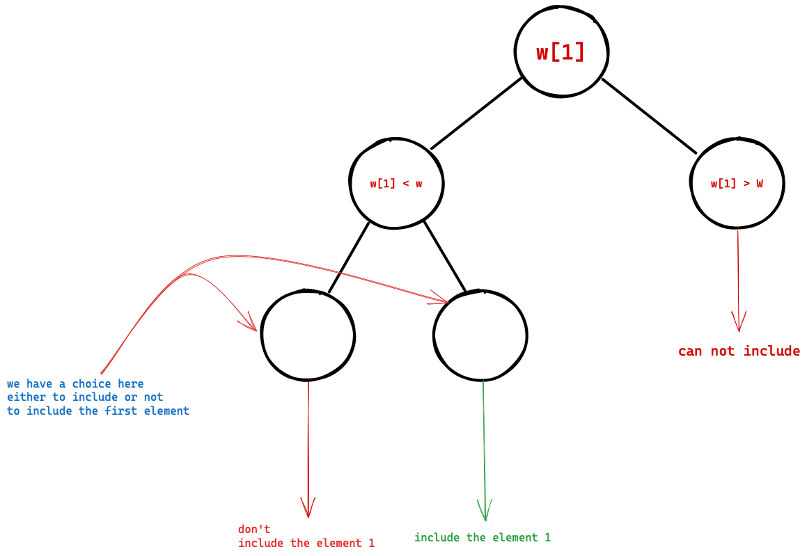

# :material-bag-personal: Knapsack Pattern

These problems discussed below conform to one knapsack pattern. Using solutions to the knapsack problem and a minor modification, you can solve almost all of the following problems. We'll discuss this as we explain the code and the approach to these problems.

**Problems** discussed

- [Vanilla $0/1$ Knapsack Problem](#vanilla-01-knapsack-problem)
- [Subset Sum](#subset-sum)
- [Equal sum partition](#equal-sum-partition)
- [Count of subset sum](#count-of-subset-sum)
- [Minimum subset sum difference](#minimum-subset-sum-difference)
- [Target Sum](#target-sum)
- [Number of subsets with given difference](#number-of-subsets-with-given-difference)


## Vanilla $0/1$ Knapsack Problem
### Problem statement
[Find the problem in GFG](https://practice.geeksforgeeks.org/problems/0-1-knapsack-problem0945/1).

It is a standard $0/1$ Knapsack Problem. Given a knapsack with $W$ bound on the weight, $p[n]$ profits for each item, $w[n]$ weights of each item, find $X \in \{0,1\}^n$ such that $p^TX$ is maximized and $w^T X \leq W$. $X$ is a solution to the $0/1$ knapsack problem.

### Approach
#### Recursive approach
Suppose $w= [1,3,4,5]$ and $p = [1,4,5,7]$. Now we have $4$ items, and we create a choice diagram. For each $i \in [n]$ we have a choice whether to include that element $i$ into the knapsack.

**Following is the choice diagram** for every element in the item list.



**Recursive design** should follow the syntax described below
```cpp
int knapsack(auto params) {
    /* BASE CONDITION */
    /* Call knapsack(params) on Choice Diagram */
}
```

Transforming the choice diagram into code

### Code
This is a simple recursive solution (not memoized).

```cpp
class Solution {
    public:
    //Function to return max value that can be put in knapsack of capacity W.

    int knapSack(int W, int wt[], int val[], int n) {
        /* BASE CONDITION [smallest value input] */
        if (n <= 0 or W <= 0) {
            return 0;
        }
        
        /* Choice Diagram */
        if (wt[n - 1] <= W) {
            return std::max(
                val[n - 1] + knapSack(W - wt[n-1], wt, val, n - 1),
                knapSack(W, wt, val, n - 1)
            );
        }
        
        // not include as capacity is lower
        return knapSack(W, wt, val, n - 1);
    }
};
```

We now memoize the solution to use the dynamic programming paradigm.

!!! note important "General approach to memoize a recursive solution" 
    - First, we need to identify what are the values that are changing,
    - Make a `vector<nested vector<int>>` 1D, 2D. 3D depending upon the number of elements changing.

```cpp
class Solution {
public:
    vector<vector<int>> dp;
    bool tableInitialized = false;
    
    //Function to return max value that can be put in knapsack of capacity W.
    int knapSack(int W, int wt[], int val[], int n) {
        // base condition [smallest value input]
        
        if (not tableInitialized) {
            dp = vector<vector<int>>(n + 1, vector<int>(W + 1, -1));
            tableInitialized = true;
        }
        
        if (dp[n][W] != -1) {
            return dp[n][W];
        }
        
        if (n <= 0 or W <= 0) {
            return 0;
        }

        if (wt[n - 1] <= W) {
            dp[n][W] = std::max(
                val[n - 1] + knapSack(W - wt[n-1], wt, val, n - 1),
                knapSack(W, wt, val, n - 1)
            );
            
            return dp[n][W];
        }
        
        // not include as capacity is lower
        dp[n][W] = knapSack(W, wt, val, n - 1);
        return dp[n][W];
    }
};
```


The following is a top-down approach for $0/1$ knapsack
```cpp
class Solution {
    public:
    //Function to return max value that can be put in knapsack of capacity W.
    int knapSack(int W, int wt[], int val[], int n) {
        int dp[n + 1][W + 1];
        memset(dp, -1, sizeof(dp));
        
        for (int i = 0; i < W + 1; i++) {
            dp[0][i] = 0;
        }
        
        for (int i = 0; i < n + 1; i++) {
            dp[i][0] = 0;
        }
        
        for (int i = 1; i < n + 1; i++) {
            for (int j = 1; j < W + 1; j++) {
                if (j >= wt[i - 1]) {
                    dp[i][j] = std::max(
                        dp[i-1][j],  // not considering the i th element
                        dp[i-1][j - wt[i-1]] + val[i-1] // considering the i th element
                    );
                } else {
                    dp[i][j] = dp[i-1][j]; // not considering the i th element
                }
            }
        }
        
        return dp[n][W];
    }
};
```

## Subset Sum
## Equal sum partition
## Count of subset sum
## Minimum subset sum difference
## Target Sum
## Number of subsets with given difference