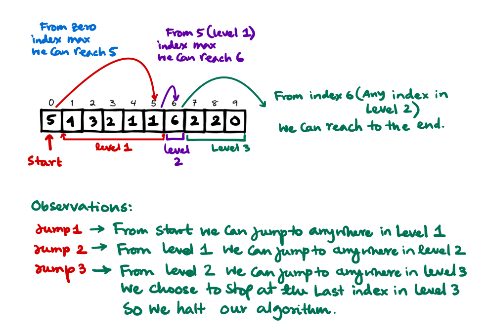

# Greedy Problems
Greedy algorithms are algorithms that follows the problem-solving heuristic of making the locally optimal choice at each stage. You can not go back on your decisions once you've taken it.

**Let's solve some greedy problems**

**Questions solved here**

- [Jump Game](#jump-game)
- [Jump Game II](#jump-game-ii)

## Jump Game
[Find the problem on Leetcode $\to$](https://leetcode.com/problems/jump-game/)
### Problem Statement
You are given an integer array `nums`. You are initially positioned at the array's first index, and each element in the array represents your maximum jump length at that position.

Return `true` if you can reach the last index, or false otherwise.

### Example
```
Input: nums = [2,3,1,1,4]
Output: true
Explanation: Jump 1 step from index 0 to 1, then 3 steps to the last index.
```

```
Input: nums = [3,2,1,0,4]
Output: false
Explanation: You will always arrive at index 3 no matter what. Its maximum jump length is 0, which makes it impossible to reach the last index.
```

### Approach
- We'll approach the problem in a reversed order. So we'll start from the end of the array and see if it is possible to reach that place, if we find any place from where we can reach the last index in the next iteration we'll see, that we can reach that index?
- We'll try to see the updated position is possible or not?

### Code
```cpp
class Solution {
public:
    bool canJump(vector<int>& nums) {
        int to_reach = nums.size() - 1;
        int index = nums.size() - 1;
        
        while (index >=0) {
            if (nums[index] + index >= to_reach) {
                to_reach = index;
            }
            
            index--;
        }
        
        return to_reach == 0;
    }
};
```

## Jump Game II
[Find the problem on leetcode $\to$](https://leetcode.com/problems/jump-game-ii/)
### Problem Statement
Given similar to the last problem, an array of non-negative integers nums, you are initially positioned at the first index of the array. Each element in the array represents your maximum jump length at that position. Our goal is to reach the last index in the minimum number of jumps.

We can **assume** that you can **always** reach the last index.

### Example
```
Input: nums = [2,3,1,1,4]
Output: 2
Explanation: The minimum number of jumps to reach the last index is 2. Jump 1 step from index 0 to 1, then 3 steps to the last index.
```

### Approach
- We'll do a simple BFS like approach here. We are at first at the first index of the array. We'll see upto where we can reach and save it as level 1.
- Similarly we'll see from level 1 upto where maximum we can jump to, we'll mark it as level 2.
- From each level we'll jump to the next level until we reach the last index or cross that.
- To hold the values of the levels we'll use a `pair<int, int>` whose first element is the lower bound of the current level and second is the upper bound of the current level.

<figure markdown>

</figure>

### C++ Code
```cpp
class Solution {
public:
    int jump(vector<int>& nums) {
        // base cases
        if (nums.size() == 1) return 0;
        
        int jumpCounter = 0;
        
        pair<int, int> level = {1, nums[0]};
        
        int index = 1;
        
        while (level.second < nums.size() - 1) {
            // find if you can get out of this level, then find the max
            // distance you can get out of this level?
            
            // this level has bounds from level.first to level.second
            int maxJumpToTheOutSide = 0;
            
            for (int i=0; i<=level.second; i++) {
                maxJumpToTheOutSide = std::max(maxJumpToTheOutSide, (nums[i] + i));
            }
            
            // jump to that location now
            level.first = level.second + 1;
            level.second = maxJumpToTheOutSide;
            index = level.first;
            
            jumpCounter++;
        }
        
        return jumpCounter + 1;
    }
};
```