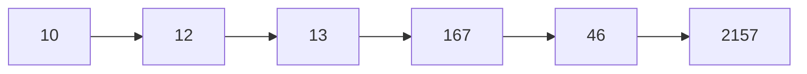
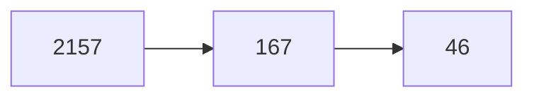

# Heap Problems

## [Kth Largest Element in an Array (Medium)](https://leetcode.com/problems/kth-largest-element-in-an-array/)

### Problem Statement
Given an integer array nums and an integer k, return the kth largest element in the array. Note that it is the kth largest element in the sorted order, not the kth distinct element.

### Examples
```
Input: nums = [3,2,1,5,6,4], k = 2
Output: 5

Input: nums = [3,2,3,1,2,4,5,5,6], k = 4
Output: 4
```

### Constraints
- $1 \leq$ `k` <= `nums.size()` $\leq$ $10^4$
- $- 10^4 \leq \text{nums[i]} \leq 10^4$

### Approach

- There are several approaches, in which 2 are the most efficient:
	- use a `k` size min heap and put values into the heap until sequence runs out.
	- use the `buildHeap()` approach to build the given sequence into a heap, then remove top k times.
- The first approach takes $O(N)$ time and no extra memory.
- The second approach takes $O(N \log K)$ time and $O(K)$ extra memory.
- If you are given a sequence with no ending (data stream) then the second one will be the better approach.
- Here in the solution we'll be using the second approach.

```cpp
class Solution {
public:
    int findKthLargest(vector<int>& nums, int k) {
        priority_queue<int, vector<int>, greater<int>> minHeap;
        
        for (auto i:nums){
            if (minHeap.size() != k){
				// Until the min Heap is not of size `K` push elements
                minHeap.push(i);
            } else {
				// Now the min Heap is of size K. Push one element [it may be the kth largest]
                minHeap.push(i);

				// If not the kth largest it'll be removed
				// Otherwise the k-1th largest will be removed
                minHeap.pop();
            }
        }
        
        return minHeap.top();
    }
};
```

## K Largest Elements in the heap
### Problem Statement
This problem is a bit different than the previous one. Here you have to return K largest elements from a given sequence. For example



For the above sequence the $K = 3$ largest elements should be the following:


### Approach
- From the above code if we look closely enough, we find that after all the operations done the remaining elements in the `k` sized heap contains all the elements that are greater or equal to the $K^{\text{th}}$ largest element in the given sequence.
- So return all the elements from the heap.

### C++ Code
```cpp
std::vector<int> kLargestElements(std::vector<int> &vector, int k){
    std::priority_queue<int, std::vector<int>, std::greater<int>> minHeap;

    std::vector<int> out;

    for (auto element:vector){
        if (minHeap.size() != k){
            minHeap.push(element);
        } else {
            minHeap.push(element);
            minHeap.pop();
        }
    }

    while (!minHeap.empty()){
        out.push_back(minHeap.top());
        minHeap.pop();
    }

    return out;
}
```

## [Top K Frequent Elements (Medium)](https://leetcode.com/problems/top-k-frequent-elements/)

### Problem Statement
Given an integer array nums and an integer k, return the k most frequent elements. You may return the answer in any order.

### Examples
```
Input: nums = [1,1,1,2,2,3], k = 2
Output: [1,2]

Input: nums = [1], k = 1
Output: [1]
```
### Constraints

<ul>
	<li><code>1 &lt;= nums.length &lt;= 10<sup>5</sup></code></li>
	<li><code>k</code> is in the range <code>[1, the number of unique elements in the array]</code>.</li>
	<li>It is <strong>guaranteed</strong> that the answer is <strong>unique</strong>.</li>
</ul>

**Follow up:** The algorithm's time complexity must be better than $O(n \log n)$, where n is the array's size.

### Approach


### Code
```cpp

```