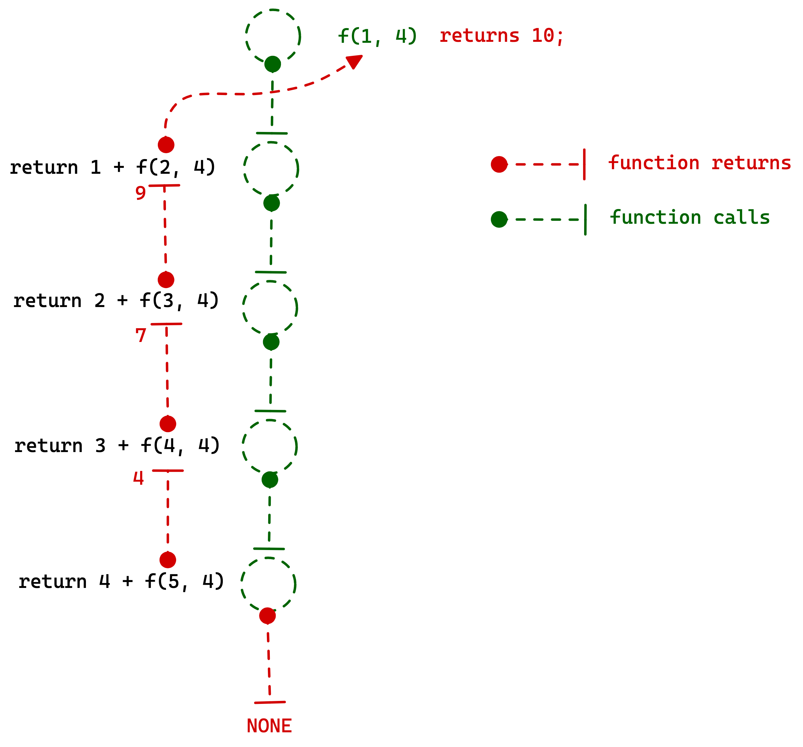

# :material-light-recessed: Introduction to recursion
Recursion is when a [function] calls itself until some condition is met. Following things we need to understand very clearly before proceeding with recursion

## What is this **making problem space smaller** idea?

We are not specifically looking for to reduce the problem space, instead we'll be making some decisions that will reduce the problem space. Reduction of problem space is a by-product of the decisions that we'll be making in a specific stage of the algorithm.

For recursive function calls a new stack space is created and the function will have no memory of what were the variables in the previous function call. To avoid this we use parameterized recursive calls.

!!! note
    `static` is just a global variable with visibility limited to one function. So if you declare it `static`, there is exactly one variable shared by all the levels of recursion. Without `static`, the variable is local, which means each function invocation has its own copy of variable's state.

## Easier Recursion problems
### Print some useful information 10 times
Following is the code for printing "something useful" 10 times with recursion,

#### Approach
- Static and global variables are stored in heap which is shared across all function calls. So we'll store a counter inside the heap to keep track of the counter across all function calls.

```cpp
void print(){
    static int count = 10;
    if (count != 0){
        cout << "Something\n";
        count--;
        print();
    } else {
        return;
    }
}

int main() {
    print();
    return 0;
}
```

### Similarly print 1 to 10 using recursive calls

```cpp
void print(){
    static int count = 10;
    if (count != 0){
        cout << count <<"\n";
        count--;
        print();
    } else {
        return;
    }
}

int main() {
    print();
    return 0;
}
```

## Functional apporach
In this apporach we will think of the problem [solution] as a recursion tree and the function calls to a smaller problem.

### Example: Sum of first N numbers
```cpp
int sumOfFirstNNumbers(int startFrom, int UpTo){
    if (startFrom <= UpTo){
        sum = startFrom + sumOfFirstNNumbers(startFrom+1, UpTo);
    }

    return sum;
}

// OR

int sumOfFirstNNumbers_2(int N){
    if (N == 0) return 0;
    return N + sumOfFirstNNumbers_static(N - 1);
}

int main() {
    std::cout << sumOfFirstNNumbers(1, 4);
}
```

**Stepwise recursive** calls for this apporach.



#### Other approaches
**Using a static** variable that is shared accross multiple function calls also works.

```cpp
int sumOfFirstNNumbers_static(int N){
    static int sum = 0; // THIS is the ACCUMULATOR

    if (N == 0) return 0;
    sum += N; // Accumulate the "N"s into the SUM.
    sumOfFirstNNumbers_static(N - 1);

    return sum;
}
```

## Reverse an array of numbers using recursive calls only
**Approach**: Add `n`th element and recursively call the function from 1 to $n-1$, and add $n-1^{th}$ elements to the answer array, again recursively call the function until we reach $0^{th}$ element.

```cpp
std::vector<int> reverse(std::vector<int> &arr, int from, int to){
	// reverse using recursion only
	static std::vector<int> ans;

	if (to != -1){
		ans.push_back(arr[to]);
		reverse(arr, from, to-1);
	}
	
	return ans;
}
```


We can also modify the original to avoid extra spaces. We can swap the last and first elements until first pointer crosses last pointer.

The following is $O(N)$ auxiliary space solution.

### Code
```cpp
void reverse(std::vector<int> &arr, int from, int to){
	// reverse using recursion only
	
	if (from <= to){
		std::swap(arr[from], arr[to]);
		reverse(arr, from+1, to-1);
	}
}
```

## Find all the sub-sequences that sums up to K.
### Problem Statement
You'll be given a sequence and with recursive calls find out all the sub-sequences that sum up to K.

### Approach
1. First we can either take or not take one element of the sequence,
2. each time we'll check if the number is taken the sum is greater than the required or not,
3. If greater we stop and return else we include it and check if the sum is equal to K?
4. If equal we simply print the sequence.

### Code
```cpp
#include <iostream>
#include <vector>

using std::cout;
using std::endl;

void solver(std::vector<int> &v, int index, int k, int sum){
    // sub-seq whose sum is K from the given sequence V

    // shared across all recursive calls
    static std::vector<int> b;

    if (index > v.size() - 1) return;

    if (sum < k){
        // try with the current value
        b.push_back(v[index]);
        sum = sum + v[index];
        solver(v, index+1, k, sum);

        // again try without the current value
        b.pop_back();
        sum = sum - v[index];
        solver(v, index+1, k, sum);
    }

    if (sum == k){
        for (auto i:b){
            cout << i << " ";
        }
        cout << endl;
    }
}
```