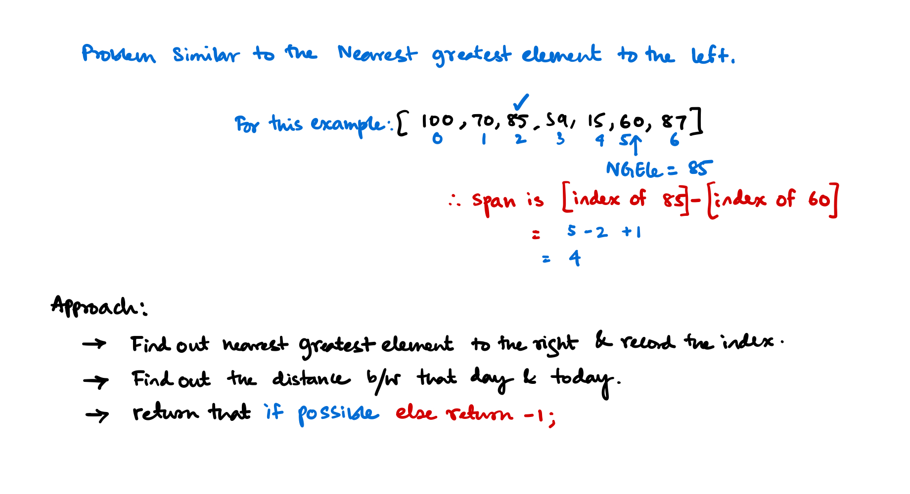

# :material-stack-overflow: Stack Problems

**Problem Index**

- [Nearest greater to right or Next Largest Element](#nearest-greater-to-right-or-next-largest-element)
- [Next Greater Element I](#next-greater-element-i)
- [Nearest greater to left (NGEle)](#nearest-greater-to-left-ngele)
- [Nearest smaller to left (NSEle)](#nearest-smaller-to-left-nsele)
- [Minimum Stack with extra space](#minimum-stack-with-extra-space)
- [Stock Span Problem](#stock-span-problem)
- [Maximum Area Histogram](#maximum-area-histogram)
- [Max Area Rectangle under binary matrix](#max-area-rectangle-under-binary-matrix)
- [The Skyline problem](#the-skyline-problem)
- [Score of Parentheses](#score-of-parentheses)


Patterns of questions when to use a stacks.

!!! note important "Using Same concept"
    - Nearest greater to right or Next Largest Element
    - Nearest greater to left
    - Nearest smaller to right
    - Nearest smaller to left

!!! note important "Using the code from the previous concept"
    - Stock Span Problem
    - Maximum area of histgram

!!! note important "Using the code from the previous two concepts"
    - Max area of rectangle in binary matrix

!!! note important "Other good problems on stack"
    - Rain water trapping
    - Implement Min stack with or without extra space

For problems with array think of using stacks, also for problems that uses nested `for loops` and the inner `for` loop is dependent upon the outer `for` loop like the following

```c
for (int i; i< n; i++){
    for(int j; j -> 0 to i; j++);
    for(int j; j -> i to 0; j--);
    for(int j; j -> i to n; j++);
    for(int j; j -> n to i; j--);
}
```
there is a huge chance that a stack data structure can be used to optimize the solution.

## Nearest greater to right or Next Largest Element
### Problem statement
Given an array, print the Next Greater Element to the right for every element. The Next greater Element for an element x is the first greater element on the right side of x in the array. Elements for which no greater element exist, consider the next greater element as -1. 
### Examples
Input Array: `[4, 5, 2, 25]`
```
Element       NGE
   4      -->   5
   5      -->   25
   2      -->   25
   25     -->   -1
```

Input Array: `[1, 3, 2, 4]`
```
Element       NGE
   1     -->   3
   3     -->   4
   2     -->   4
   4     -->   -1
```

### Brute Force approach
- Traverse the whole array, for each element at i, traverse from i+1 to at worst n to get the first element that is greater than the element at i.
- This is a pattern for nested `for loops` and the inner `for` loop is dependent upon the outer `for` loop. So we can use a stack to optimize the solution.


```python
def brute_force_NGE(array: list[int]) -> None:
    for i in range(len(array)):
        for j in range(i+1, len(array)):
            # ...
            pass
        # ...
        pass
    return None
```

### Optimized solution with Stacks

#### Stack implementation


```python
from collections import deque

class Stack:
    def __init__(self):
        self.container = deque()
    
    def pop(self):
        return self.container.pop()
    
    def push(self, value):
        self.container.append(value)
    
    def tos(self):
        return self.container[-1] if self.container else -1
    
    def isEmpty(self):
        return len(self.container) == 0
```

### Optimized apporach with stacks
- We start from the very last, and maintain a stack.
- if the stack is empty means that there is no element that is just greater to the right of this element so return -1
- if we don't find anything then push the element onto the stack.
- if the `a[i]` element is < the top of the stack means that `tos()` is the next greater element,
- if the `a[i]` is > the top of the stack then we `pop()` from the stack to find if there is any element > the `a[i]`, if not return -1.


```python
def NGE(array):
    stack = Stack()
    returnarray = []
    
    end = len(array) - 1
    
    while end >= 0:  # unitl we reach to the front
        if stack.isEmpty():
            stack.push(array[end])
            returnarray.append(-1)
        else:
            while not stack.isEmpty() and stack.tos() <= array[end]:
                stack.pop()
            
            if stack.isEmpty():
                stack.push(array[end])
                returnarray.append(-1)
            
            elif stack.tos() > array[end]:
                returnarray.append(stack.tos())
                stack.push(array[end])
        
        end -= 1
    
    return returnarray[::-1]
```


```python
from rich.console import Console
console = Console()

console.print(NGE([1, 3, 2, 4]))
```


```python
console.print(NGE([4, 5, 2, 25]))
```


```python
console.print(NGE([3, 2, 1, 0, 2, 4, 2, 6, 9]))
console.print(NGE([3, 2, 11, -0.4, 2, 4, 2, 6, 91]))
```

## Next Greater Element I
[Find the problem on Leetcode $\to$](https://leetcode.com/problems/next-greater-element-i/description/)
### Problem Statement
The next greater element of some element $x$ in an array is the first greater element that is to the right of $x$ in the same array.

You are given two distinct `0`-indexed integer arrays `nums1` and `nums2`, where `nums1` is a subset of `nums2`.

For each `0 <= i < nums1.length`, find the index j such that `nums1[i] == nums2[j]` and determine the next greater element of `nums2[j]` in `nums2`. If there is no next greater element, then the answer for this query is $-1$.

Return an array ans of length nums1.length such that `ans[i]` is the next greater element as described above.

### Example
```
Input: nums1 = [4,1,2], nums2 = [1,3,4,2]
Output: [-1,3,-1]
Explanation: The next greater element for each value of nums1 is as follows:
- 4 is underlined in nums2 = [1,3,4,2]. There is no next greater element, so the answer is -1.
- 1 is underlined in nums2 = [1,3,4,2]. The next greater element is 3.
- 2 is underlined in nums2 = [1,3,4,2]. There is no next greater element, so the answer is -1.


Input: nums1 = [2,4], nums2 = [1,2,3,4]
Output: [3,-1]
Explanation: The next greater element for each value of nums1 is as follows:
- 2 is underlined in nums2 = [1,2,3,4]. The next greater element is 3.
- 4 is underlined in nums2 = [1,2,3,4]. There is no next greater element, so the answer is -1.
```

### Approach
We'll use the up above technique (usage of stacks) to find the next greater element to the right.

### Code
```cpp
class Solution {
public:
    vector<int> nextGreaterElement(vector<int>& nums1, vector<int>& nums2) {
        std::unordered_map<int, int> nge;
        vector<int> stack;
        
        int last = nums2.back();
        stack.push_back(last);
        nge[last] = -1;

        int size = nums2.size();

        for (int i = size - 2; i >= 0; i--) {
            while (not stack.empty() and nums2[i] > stack.back()) {
                stack.pop_back();
            }

            if (stack.empty()) {
                nge[nums2[i]] = -1;
            } else if (nums2[i] < stack.back()) {
                nge[nums2[i]] = stack.back();
            }
            
            stack.push_back(nums2[i]);
        }

        vector<int> answer;

        for (int i:nums1) {
            answer.push_back(nge[i]);
        }

        return answer;
    }
};
```

## Nearest greater to left (NGEle)
### Problem statement
Given an array, print the Next Greater Element to the left for every element. The Next greater Element for an element x is the first greater element on the left side of x in the array. Elements for which no greater element exist, consider the next greater element as -1. 
### Examples
Input Array: `[4, 5, 2, 25]`
```
Element       NGEle
   4      -->   -1
   5      -->   -1
   2      -->   5
   25     -->   -1
```

Input Array: `[1, 3, 2, 4]`
```
Element       NGEle
   1     -->   -1
   3     -->   -1
   2     -->   3
   4     -->   -1
```
### Approach
- Similar to the NGE but we start from the left because we have to operate on the left sub-array.


```python
from collections import deque

class Stack:
    def __init__(self):
        self.s = deque()
    def push(self, value):
        self.s.append(value)
    def pop(self):
        return self.s.pop()
    def tos(self):
        return self.s[-1]
    def isEmpty(self):
        return len(self.s) == 0

def NGEle(array: list[int]):
    last = len(array)
    out = []
    
    stack = Stack()
    
    for i in range(0, last):
        if stack.isEmpty():
            stack.push(array[i])
            out.append(-1)
        else:
            while not stack.isEmpty() and stack.tos() < array[i]:
                stack.pop()
            if stack.isEmpty():
                stack.push(array[i])
                out.append(-1)
            elif stack.tos() > array[i]:
                out.append(stack.tos())
                stack.push(array[i])
    return out
```


```python
print(NGEle([4, 5, 2, 25]))    # --> [-1, -1, 5, -1]
```

```python
print(NGEle([1, 3, 2, 4]))    # --> [-1, -1, 3, -1]
```


```python
print(NGEle([4, 5, 2, 0.5, 25]))
print(NGEle([1]), NGEle([]), NGEle([-13, -12, -11, -10])) # Some corner cases
```

```
[-1, -1, 5, 2, -1]
[-1] [] [-1, -1, -1, -1]
```

## Nearest smaller to left (NSEle)
### Problem statement
Given an array, print the Next Greater Element to the left for every element. The Next greater Element for an element x is the first greater element on the left side of x in the array. Elements for which no greater element exist, consider the next greater element as -1. 
### Examples
Input Array: `[4, 5, 2, 25]`
```
Element       NSEle
   4      -->   -1
   5      -->   4
   2      -->   -1
   25     -->   2
```

Input Array: `[1, 3, 2, 4]`
```
Element       NSEle
   1     -->   -1
   3     -->   1
   2     -->   1
   4     -->   2
```

### Approach
- Drop the bad Brute force approach, we should use a stack
- Start from the begining and traverse throught the array from $0 \to \mathcal{N}$
- For each element check the left sub-array using a stack.
- Pop elements out of the stack if they are greater and push the current element.
- return -1 for empty stack and `tos()` if we find elements lesser (i.e. the lesser element).


```python
from collections import deque

class Stack:
    def __init__(self):
        self.s = deque()
    def pop(self):
        return self.s.pop()
    def isEmpty(self):
        return len(self.s) == 0
    def push(self, value):
        self.s.append(value)
    def tos(self):
        return self.s[-1]

        
def NSEle(array: list[int]) -> list[int]:
    end = len(array)
    stack = Stack()
    
    out = []
    
    for i in range(0, end):
        if stack.isEmpty():
            stack.push(array[i])
            out.append(-1)
        else:
            while not stack.isEmpty() and (stack.tos() > array[i]):
                stack.pop()
            if stack.isEmpty():
                stack.push(array[i])
                out.append(-1)
            elif stack.tos() < array[i]:
                out.append(stack.tos())
                stack.push(array[i])
    return out
```


```python
print(NSEle([4, 5, 2, 25]))
print(NSEle([1, 3, 2, 4]))
print(NSEle([4, 5, 2, 0.5, 25]))
print(NSEle([-13, -12, -11, -10]))
print(NSEle([1]), NSEle([]), NSEle([13, 12, 11, 10])) # Some corner cases
```
```
[-1, 4, -1, 2]
[-1, 1, 1, 2]
[-1, 4, -1, -1, 0.5]
[-1, -13, -12, -11]
[-1] [] [-1, -1, -1, -1]
```


## Minimum Stack with extra space
### Problem Statement

Implement a stack with the following methods:

1. `MinimumStack()` constructs a new instance of a minimum stack
2. `append(int val)` appends val to the stack
3. `peek()` retrieves the last element in the stack
4. `min()` retrieves the minimum value in the stack
5. `pop()` pops and returns the last element in the stack
Each method should be done in $\mathcal{O}(1)$ time. You can assume that for peek, min and pop, the stack is non-empty when they are called.

### Constraints
$n ≤ 100000$ where `n` is the number of calls to append, peek, min, and pop.

### Approach
- We'll use a two stack approach, one to keep track of all the stack elements (`self.container`) and an auxiliary stack to keep track all the minimum elements.
- Whenever we find a new `min` element we'll push it into the `self.aux` stack.
- When we find `pop()` and find same `tos()` for `self.container` and `self.aux` means that the current minimum element is being `popped` off. So we `pop()` from both.

=== "Python"
    ```python
    class MinimumStack:
        def __init__(self):
            self.container = deque()
            self.aux = deque()

        def append(self, val):
            self.container.append(val)

            if len(self.aux) == 0:
                self.aux.append(val)

            elif len(self.aux) > 0 and val < self.aux[-1]:
                self.aux.append(val)

        def peek(self):
            return self.container[-1]

        def min(self):
            return self.aux[-1]

        def pop(self):
            if self.aux[-1] == self.container[-1]:
                k = self.container.pop()
                self.aux.pop()
                return k
            else:
                return self.container.pop()
    ```
=== "C++"
    ```cpp
    #include <iostream>
    #include <vector>

    using namespace std;

    class MinStack{
    private:
        vector<int> stack;
        vector<int> auxStack;
        int ClassPrivateSize;

    public:
        MinStack(){
            ClassPrivateSize = 0;
        }

        int size(){
            return ClassPrivateSize;
        }

        void push(int value){

            if (ClassPrivateSize == 0){
                stack.push_back(value);
                auxStack.push_back(value);
                ClassPrivateSize += 1;
            }else{
                if (value < auxStack.back()){
                    stack.push_back(value);
                    auxStack.push_back(value);
                }else{
                    stack.push_back(value);
                }
                ClassPrivateSize += 1;
            }
        }

        int pop(){
            if (ClassPrivateSize == 0){
                throw runtime_error("pop(): Empty Stack");
            }else{

                if (auxStack.back() == stack.back()){
                    int value = stack.back();
                    auxStack.pop_back();
                    stack.pop_back();

                    return value;
                }else{
                    int value = stack.back();
                    stack.pop_back();
                    return value;
                }
                ClassPrivateSize -=1;
            }
        }

        bool isEmpty() const{
            if (ClassPrivateSize == 0){
                return true;
            }
            return false;
        }

        int min(){
            return auxStack.back();
        }

        int peek() {
            return stack.back();
        }

    };
    ```

### Time Complexity
- `push()` takes $\mathcal{O}(1)$
- `pop()` takes $\mathcal{O}(1)$
- `min()` takes $\mathcal{O}(1)$
- `peek()` takes $\mathcal{O}(1)$

### Space Complexity
At the very worst total space complexity is $\mathcal{O}(N)$


## Stock Span Problem
### Problem Statement
Equivalent problems are on [LeetCode](https://leetcode.com/problems/online-stock-span/) and [GeeksForGeeks](https://www.geeksforgeeks.org/the-stock-span-problem/)

- The stock span problem is a financial problem where we have a series of n daily price quotes for a stock and we need to calculate span of stock’s price for all n days.
- The span Si of the stock’s price on a given day i is defined as the maximum number of consecutive days just before the given day, for which the price of the stock on the current day is less than its price on the given day. 

#### Example testcase
For example, if an array of $7$ days prices is given as $\{100, 80, 60, 70, 60, 75, 85\}$, then the span values for corresponding 7 days are $\{1, 1, 1, 2, 1, 4, 6\}$. For simplicity,

- For day $1$, no days are before this day that has more than this day's stock value so return $1$
- For day $3$, no days are before this day that has more than this day's stock value so return $1$
- For day $4$, there is exactly one day that has more than this day's stock value so return $1 + 1 = 2$
- For the last day stock value is $85$ and there is total 5 days before this day which has less stock value: $\{75, 60, 70, 60, 80\}$. So return $5+1 =6$

### Approach
If we look closely, this problem is really the NGEle problem (Nearest greatest to the left), now instead of returning that we find/count how much (long) ago that *nearest smallest* was?

So the apporach should be

- Figure out the NGEle first with stack in $O(\mathcal{N})$ space.
- Now use as much $O(\mathcal{N})$ space as possible beacuse you can not reduce it, so keep the program simple.
- Finally instead of the NGEle array we return the NGEle array along with what was the index number of that NGEle element using a vector of pairs.
- Now for the `stockSpan()` function we will return the difference between the position of current element and the position of the NGEle element.


<figure markdown>
  
  <figcaption>Stock Span Problem Brainstorm!</figcaption>
</figure>


```cpp
#include <iostream>
#include <vector>

using namespace std;

vector<pair<int, int>> NGEle(vector<int> vect){
    // Return a pair with NGEle and the position of the NGEle.
    vector<pair<int, int>> out;
    // While storing the values into stack just add the current index to keep track
    // of where the NGEle is located.
    vector<pair<int, int>> stack;

    // Common NGEle Code [it's the same lolzzzzz].
    int index = 0;
    for (int element:vect){
        if (stack.size() == 0){
            out.push_back({-1, -1});
            stack.push_back({element, index});
        }else{
            while ((stack.size() != 0) && (stack.back().first < element)){
                stack.pop_back();
            }
            if (stack.size() == 0){
                out.push_back({-1, index});
                stack.push_back({element, index});
            }else if (stack.back().first > element){
                out.push_back({stack.back().first,stack.back().second});
                stack.push_back({element, index});
            }
        }
        index++;
    }

    return out;
}


vector<int> stockSpan(vector<int> marketCap){
    // find NGEle Values for each day along with their indexes.
    vector<pair<int, int>> ngele = NGEle(marketCap);

    vector<int> out;

    int idx = 0;
    
    // Now for each element find the distance between it and it's NGEle.
    for (auto i: ngele){
        if (i.second != -1){
            out.push_back(idx - i.second + 1);
        }else{
            out.push_back(1);
        }
        idx++;
    }

    return out;
}
```

Let's test the code out. Run the following code to see the code working.
```cpp
int main(){
    vector<int> v = {100, 70, 85, 59, 15, 60, 87};
    vector<pair<int, int>> ngele = NGEle(v);
    vector<int> stkspan = stockSpan(v);

    cout << "Market CAP" <<endl;
    for (auto j: v)
        cout << j << " ";
    cout << endl;
    cout << endl;

    // ngele Array
    for (auto i: ngele){
        cout << i.first << " from: " << i.second << "\n";
    }
    cout << endl;

    cout << "Stock Span" <<endl;
    for (auto h: stkspan)
        cout << h << " ";
    cout << endl;

    return 0;
}
```
### Time Complexity
At the very worst case time complexity is $O(\mathcal{N})$ because we are traversing the `marketCap` vector only once during the subroutine `NGEle()` and once in the subroutine `stockSpan()`.


### Space Complexity
Space complexity is $O(\mathcal{N})$.


## Maximum Area Histogram
### Problem Statement
[Similar problem on Leetcode](https://leetcode.com/problems/largest-rectangle-in-histogram/)

Given an array of integers heights representing the histogram's bar height where the width of each bar is $1$, return the area of the largest rectangle in the histogram.

#### Examples


```
Input: heights = [2,1,5,6,2,3]
Output: 10

Explanation: 
The above is a histogram where width of each bar is 1.
The largest rectangle is shown in the red area, which has an area = 10 units.
```
### Thought process
<figure markdown>
  
  <figcaption>Brainstorm!</figcaption>
</figure>

### Approach
<figure markdown>
  
  <figcaption>Proper Approach!</figcaption>
</figure>

### Time and Space complexity
$O(\mathcal{N})$ time and space is taken.

### Code
#### Subroutines
Two subroutines are needed $\to$ and these are NSEle and NSR. Neareast smaller to the left and neareast smaller to the right.

#### NSR (NSE, Nearest smaller to the Right) implementation
```cpp
#include <iostream>
#include <vector>

using std::vector;
using std::pair;


vector<pair<int, int>> NSE(vector<int> vect){
    // Nearest smallest to the right
    // finds and returns NSE array pair.first -> value
    // pair.second -> index of the NSE element
    vector<pair<int, int>> out;
    vector<pair<int, int>> stack;

    int last = vect.size() - 1;

    while (last != -1){
        if (stack.size() == 0){
            out.push_back({-1, -1});
            stack.push_back({vect[last], last});
        }else{
            while ((stack.size() != 0) && (stack.back().first >= vect[last])){
                stack.pop_back();
            }
            if (stack.size() == 0){
                out.push_back({-1, -1});
                stack.push_back({vect[last], last});
            }else if (stack.back().first < vect[last]){
                out.push_back({stack.back().first, stack.back().second});
                stack.push_back({vect[last], last});
            }
        }

        last--;
    }

    return out;
}
```

#### NSEle (Nearest smaller to the left) implementation
```cpp
vector<pair<int, int>> NSEle(vector<int> vect){

    vector<pair<int, int>> out;
    vector<pair<int, int>> stack;

    int start = 0;

    while (start != vect.size()){
        if (stack.size() == 0){
            out.push_back({-1, -1});
            stack.push_back({vect[start], start});
        }else{
            while ((stack.size() != 0) && (stack.back().first >= vect[start])){
                stack.pop_back();
            }
            if (stack.size() == 0){
                out.push_back({-1, -1});
                stack.push_back({vect[start], start});
            }else if (stack.back().first < vect[start]){
                out.push_back({stack.back().first, stack.back().second});
                stack.push_back({vect[start], start});
            }
        }

        start++;
    }

    return out;
}
```

#### The main function `maxAreaHistogram()`
```cpp
void maxAreaHistogram(vector<int> v){

    vector<int> out;

    vector<pair<int, int>> nsr = NSE(v);
    // NSR has to-be reverse because we started from the begining
    std::reverse(nsr.begin(), nsr.end());

    vector<pair<int, int>> nsele = NSEle(v);

    int currentMax = -1;

    int index = 0;
    int currentArea = 0;

    for (int i:v){

        if ((nsr[index].first != -1) && (nsele[index].first != -1)){
            // Both upper and lower bound is within the array
            // Start from left bound + 1
            // end at the upper bound - 1 (don't cosinder the upper bound bcz it's smaller)
            currentArea = i * ((nsr[index].second - 1) - (nsele[index].second + 1) + 1);
        }else if ((nsr[index].first == -1) && (nsele[index].first != -1)){
            // right side -> -1 no smaller element to the right
            // Start from left bound + 1, (don't consider the left bound)
            // end at last
            currentArea = i * (v.size()-1 - (nsele[index].second + 1) + 1);
        }else if ((nsele[index].first == -1) && (nsr[index].first != -1)){
            // No bound to the left
            // So from index zero -> the upper bound
            currentArea = i * (nsr[index].second - 1 + 1);
        }else{
            // No bound at all -> size * magnitude
            currentArea = i * (v.size());
        }

        out.push_back(currentArea);

        index++;
    }

    for (auto value:out)
        std::cout << BOLDBLUE << value << " ";
    std::cout << std::endl;
}
```
#### Testing the code out
```cpp

int main(){
    // testsForNSE();
    // testsForNSEle();
    vector<int> v = {1, 2, 3, 1, 2, 3, 4, 5, 5, 5};
    std::cout << BOLDCYAN << "TEST CASE 1" << RESET << std::endl;
    maxAreaHistogram(v);

    vector<int> v1 = {2,1,5,6,2,3};
    std::cout << BOLDYELLOW << "TEST CASE 2" << RESET << std::endl;
    maxAreaHistogram(v1);

    vector<int> v2 = {2,4,1,4,4,5};
    std::cout << BOLDMAGENTA << "TEST CASE 4" << RESET << std::endl;
    maxAreaHistogram(v2);
    
    vector<int> v12 = {5,5,5,5,5,2,4,2,1};
    std::cout << BOLDGREEN << "TEST CASE 3" << RESET << std::endl;
    maxAreaHistogram(v12);

    vector<int> v23 = {3,2,1};

    std::cout << BOLDMAGENTA << "TEST CASE 4" << RESET << std::endl;
    maxAreaHistogram(v23);


    vector<int> v231 = {10, 9, 8, 7};

    std::cout << BOLDRED << "TEST CASE 4" << RESET << std::endl;
    maxAreaHistogram(v231);

    vector<int> v2321 = {7,8,9,10};

    std::cout << BOLDMAGENTA << "TEST CASE 4" << RESET << std::endl;
    maxAreaHistogram(v2321);
    return 0;
}
```

#### Output
```text
TEST CASE 1
10 4 3 10 12 15 16 15 15 15 

TEST CASE 2
2 6 10 6 8 3 

TEST CASE 4
4 4 6 12 12 5 

TEST CASE 3
25 25 25 25 25 16 4 16 9 

TEST CASE 4
3 4 3 

TEST CASE 4
10 18 24 28 

TEST CASE 4
28 24 18 10 
```

## Max Area Rectangle under binary matrix
[Problem On leetcode $\to$](https://leetcode.com/problems/maximal-rectangle/)
### Problem Statement
Given a binary matrix $\mathcal{M}$ find out what is the maximum area of the rectangle $R$, where all elements in $R = 1$


!!! info important "Explanation"
    Input: matrix = `[["1","0","1","0","0"],["1","0","1","1","1"],["1","1","1","1","1"],["1","0","0","1","0"]]`

    Output: 6

    Explanation: The maximal rectangle is shown in the above picture.

### Constraints:

- `rows` == `matrix.length`
- `cols` == `matrix[i].length`
- 1 <= `row, cols` <= 200
- `matrix[i][j]` is $0$ or $1$.

### Approach
<figure markdown>
  
  <figcaption>Proper Approach!</figcaption>
</figure>


- We should start with creating histogram for each level.
- Then we call the `MAH()` algorithm implemented in the previous question.
- Then we find the maximum accross all levels.


## The Skyline problem

[Same Problem on Leetcode $\to$](https://leetcode.com/problems/the-skyline-problem/)

### Problem Statement
A city's skyline is the outer contour of the silhouette formed by all the buildings in that city when viewed from a distance. Given the locations and heights of all the buildings, return the skyline formed by these buildings collectively.


## Score of Parentheses
[Problem on leetcode $\to$](https://leetcode.com/problems/score-of-parentheses/)

### Problem Statement
Given a balanced parentheses string s, return the score of the string
- "()" has score 1,
- AB has score A + B, where A and B are balanced parentheses strings,
- (A) has score 2 * A, where A is a balanced parentheses string.

### Examples
```
Input: s = "()"
Output: 1

Input: s = "(())"
Output: 2

Input: s = "()()"
Output: 2
```

### Constraints
- $2$ <= `s.length` <= $50$
- `s` consists of only `'('` and `')'`.
- `s` is always a balanced parentheses string.

### Approach
- Using recursion because seems like a recursive problem with pattern of `return (what is inside of(what is inside of (what is inside)))`.

### C++ code

```cpp
class Solution {
private:
    int globalTracker = 0;
public:
    int scoreOfParentheses(string s) {
        int score = 0;
        
        // Using recursion bcz seems like a recursive problem
        // return (what is inside of(what is inside of (what is inside)))
        
        while(globalTracker < s.size() - 1){
            char first = s.at(globalTracker);
            globalTracker++;
            char second = s.at(globalTracker);
            
            if (first == '('){
                if (second == ')'){
                    score = score + 1;
                    globalTracker++;
                } else {
                    score = score + 2 *(scoreOfParentheses(s));
                }
            } else {
                return score;
            }
            
        }
        
        return score;
    }
};
```