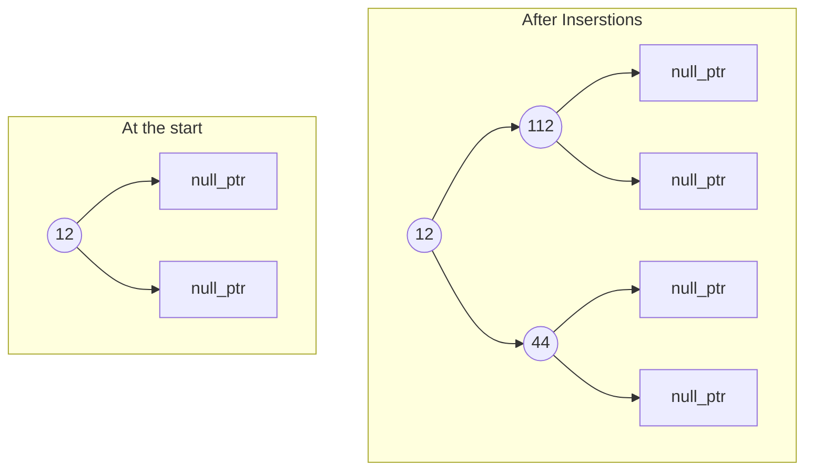

# Tree implementation
Tree is a non linear graph data structure which has no cycle. Tree is hiararchical data structure, any sort of data that has some sort of hiararchy we can use a tree to represent, get, delete efficiently.

## Tree Standard struct
`STL` don't have general binary tree representation [has red black tree (height balanced binary search tree)]. The following `struct` can be used to represent a tree structure.

```cpp
struct TreeNode {
    int data;
    TreeNode *left;
    TreeNode *right;

    TreeNode(int value) {
        data  = value;
        left  = nullptr;
        right = nullptr;
    }
};

// Create a Tree Structure
int main() {
    TreeNode *root = new TreeNode(12);
    root->left     = new TreeNode(112);
    root->right    = new TreeNode(44);
}
```

**Visual representation of the structure**:


### **See the problem section now**

[Tree Problem Section](/trees/problems){ .md-button .md-button--primary }