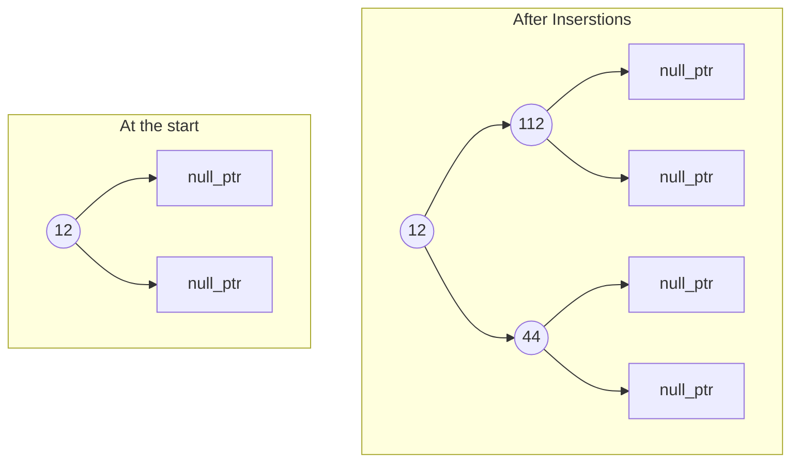

# :material-graph: Tree implementation
Tree is a non linear graph data structure which has no cycle. Tree is hiararchical data structure, any sort of data that has some sort of hiararchy we can use a tree to represent, get, delete efficiently.

## Tree Standard struct
`STL` don't have general binary tree representation [has red black tree (height balanced binary search tree)]. The following `struct` can be used to represent a tree structure.

```cpp
struct TreeNode {
    int data;
    TreeNode *left;
    TreeNode *right;

    TreeNode(int value) {
        data  = value;
        left  = nullptr;
        right = nullptr;
    }
};

// Create a Tree Structure
int main() {
    TreeNode *root = new TreeNode(12);
    root->left     = new TreeNode(112);
    root->right    = new TreeNode(44);
}
```

**Visual representation of the structure**:


## Tree from input stream
Now for some cases you may have to take input from a stream of numbers and create a tree structure from them. Here is a detailed implementation on how to do that.

First we create a character array and put the entire stream into that character array,
```cpp
// Get complete binray tree input from a stream
char a[1000];
cin.getline(a, 1000);
```

Now we create a vector and we'll tokenize the character array and get all the numbers from them into the vector.
```cpp
vector<int> v;

// String TOKENIZER to get all the numbers and convert them into integers
// then push it into the vector
char *ans = strtok(a, " ");
while (ans != NULL){
    v.push_back(stoi(ans));
    ans = strtok(NULL, " ");
}
```

Now most of the cases this will be some traversal order, and from this traversal order we create a binary tree. The most logical way one can provide the input is that they give you the level order traversal of the tree in that stream.

Here is a Tree Class and a function to create a binary tree from a vector of numbers.

```cpp
// Tree Definition
class Tree {
public:
    int data;
    Tree* left, *right;

    Tree(int d){
        data = d;
        left = nullptr;
        right = nullptr;
    }
};
```

Creating tree from the input vector

```cpp
Tree* createTreeFromVector(vector<int> v) {
    if (v.size()==0) return nullptr;

    int root = v[0];
    Tree* treeRoot = new Tree(root);

    // start from the 1st element and push into a queue and add it to left of root;
    // because we push data in from left to right in complete binary tree

    queue<Tree*> q;
    q.push(treeRoot);
    int i = 1;

    while(!q.empty()){
        Tree* thisNode = q.front();
        q.pop();

        thisNode->left = new Tree(v[i++]);
        q.push(thisNode->left);
        if (i >= v.size()) break;

        thisNode->right = new Tree(v[i++]);
        q.push(thisNode->right);
        if (i >= v.size()) break;
    }

    return treeRoot;
}
```

### **See the problem section now**

[Tree Problem Section](/trees/problems){ .md-button .md-button--primary }