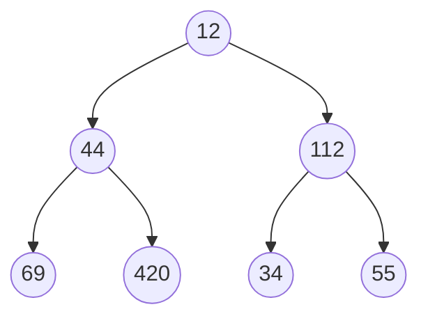
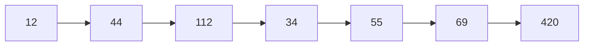

# Tree Problems

## Traversal problems
### Inorder, preorder, and postorder traversal
Let's don't waste time and finish the "confusing" topic of pre order, post order and in order traversal on binary trees. Most of my friends tell me that they often forget how each traversal works and ask me how to remember them. Well, here you go

When running through a tree (binary or binary search tree) we start from the root. Now arrange the queue of nodes like this if we visit

1. the node for the first time we add that to the pre-order queue,
2. the node for the second time we add that to the in-order queue,
3. the node for the 3rd time we add that to the post-order queue.

And now you have 3 queues each with pre-in-post order traversal path.

Also make a note that if the binary tree is a binary search tree, then the in-order traversal will give a sorted array. We can use this property to check if the binary tree is a binary search tree or not.

### More formal definition
1. Pre order traversal is implemented like this: $\text{Root} \to \text{Left} \to \text{Right}$
2. In-order traversal is implemented like this: $\text{Left} \to \text{Root} \to \text{Right}$
3. In-order traversal is implemented like this: $\text{Left} \to \text{Right} \to \text{Root}$

### C++ Code
```cpp
// Definition of the tree node
struct TreeNode {
    int data;
    TreeNode *left;
    TreeNode *right;

    TreeNode(int value) {
        data  = value;
        left  = nullptr;
        right = nullptr;
    }
};


void inOrderTraversal(TreeNode *nodePointer){

    if (nodePointer != nullptr) {
        inOrderTraversal(nodePointer->left);
        printf("%d ", nodePointer->data);
        inOrderTraversal(nodePointer->right);
    }
}

void preOrderTraversal(TreeNode *nodePointer){

    if (nodePointer != nullptr) {
        printf("%d ", nodePointer->data);
        preOrderTraversal(nodePointer->left);
        preOrderTraversal(nodePointer->right);
    }
}

void postOrderTraversal(TreeNode *nodePointer){

    if (nodePointer != nullptr) {
        postOrderTraversal(nodePointer->left);
        postOrderTraversal(nodePointer->right);

        printf("%d ", nodePointer->data);
    }
}
```

### Level order traversal for binary trees

For the following binary tree



The equivalent level order traversal should be


#### Approach
- If you see there is a queuing order, every level of the tree gets processed from left to right.
- Then in the next level they are processed from left to right as well as their parent's order.
- So if we use a queue we can solve this problem.
    
- With queue we can solve this problem, and here is a step by step approach
    

## Balanced Binary Tree
[Problem on leetcode $\to$](https://leetcode.com/problems/balanced-binary-tree/)
### Problem Statement
Given a binary tree, determine if it is height-balanced.

### Approach
- If a binary tree is height-balanced then the difference of height of the right subtree and left subtree should not be greater than 2.
- Now from the last problem we can recursivly find the height of the left and right subtrees and check if the difference between them is > 1.
- If at any point we find that the height difference is > 1, we indicate this some how to the main function and say it's not height balanced.

### Code
```cpp
class Solution {
public:
    int height(TreeNode *root) {
        if (!root) return 0;
        
        // recursively find the height of subtrees
        int leftheight = height(root->left);
        int rightheight = height(root->right);
        
        // if we find a height imbalance we inform it to the parent.
        if (std::abs(leftheight - rightheight) > 1) return -1;

        // If [at parent] we find one of the subtrees has height imbalance
        // we return -1 and exit the program
        if (leftheight == -1 or rightheight == -1) return -1;
        
        return 1 + max(leftheight, rightheight);
    }
    
    bool isBalanced(TreeNode* root) {
        // if the subroutine finds anywhere in the tree a height imbalance
        // we return false.
        return height(root) != -1;
    }
};
```

## Branch Sum Problem
### Problem Statement
You'll be given the root node of the binary tree. Now you have to return all the branch's "SUM" in a vector.
### Example:
