# :material-graph: Tree Problems

**Questions discussed**

- [Traversal problems](#traversal-problems)
- [N-ary Tree Preorder Traversal](#n-ary-tree-preorder-traversal)
- [Balanced Binary Tree](#balanced-binary-tree)
- [Branch Sum Problem](#branch-sum-problem)
- [Invert a binary tree](#invert-a-binary-tree)
- [Iterative In Order Traversal](#iterative-in-order-traversal)
- [Minimum Depth of a Binary Tree](#minimum-depth-of-a-binary-tree)
- [Connect Level Order Siblings](#connect-level-order-siblings)
- [Binary Tree Path Sum](#binary-tree-path-sum)
- [Count All Paths for a Sum](#count-all-paths-for-a-sum)
- [Traceout All Paths for a Sum](#traceout-all-paths-for-a-sum)
- [Validate a Binary Search Tree](#validate-a-binary-search-tree)
- [Find Kth Largest value in the binary search tree](#find-kth-largest-value-in-the-binary-search-tree)
- [Find the total number of Binary Search Trees possible](#find-the-total-number-of-binary-search-trees-possible)
- [Same Binary Search Tree](#same-binary-search-tree)
- [Binary Search Tree Iterator](#binary-search-tree-iterator)
- [Count Complete Tree Nodes](#count-complete-tree-nodes)
- [Deepest Leaves Sum](#deepest-leaves-sum)
- [Sum of Nodes with Even-Valued Grandparent](#sum-of-nodes-with-even-valued-grandparent)
- [Same Tree](#same-tree)
- [Flatten Binary Tree to Linked List](#flatten-binary-tree-to-linked-list)
- [Lowest Common Ancestor of a Binary Search Tree](#lowest-common-ancestor-of-a-binary-search-tree)
- [Maximum Product of Splitted Binary Tree](#maximum-product-of-splitted-binary-tree)
- [Count Good Nodes in Binary Tree](#count-good-nodes-in-binary-tree)
- [Trim a Binary Search Tree](#trim-a-binary-search-tree)
- [Binary Tree Right Side View](#binary-tree-right-side-view)

## Traversal problems
### Inorder, preorder, and postorder traversal
Let's don't waste time and finish the "confusing" topic of pre order, post order and in order traversal on binary trees. Most of my friends tell me that they often forget how each traversal works and ask me how to remember them. Well, here you go

When running through a tree (binary or binary search tree) we start from the root. Now arrange the queue of nodes like this if we visit

1. the node for the first time we add that to the pre-order queue,
2. the node for the second time we add that to the in-order queue,
3. the node for the 3rd time we add that to the post-order queue.

And now you have 3 queues each with pre-in-post order traversal path.

Also make a note that if the binary tree is a binary search tree, then the in-order traversal will give a sorted array. We can use this property to check if the binary tree is a binary search tree or not.

### More formal definition
1. Pre order traversal is implemented like this: $\text{Root} \to \text{Left} \to \text{Right}$
2. In-order traversal is implemented like this: $\text{Left} \to \text{Root} \to \text{Right}$
3. In-order traversal is implemented like this: $\text{Left} \to \text{Right} \to \text{Root}$

### C++ Code
```cpp
// Definition of the tree node
struct TreeNode {
    int data;
    TreeNode *left;
    TreeNode *right;

    TreeNode(int value) {
        data  = value;
        left  = nullptr;
        right = nullptr;
    }
};


void inOrderTraversal(TreeNode *nodePointer){

    if (nodePointer != nullptr) {
        inOrderTraversal(nodePointer->left);
        printf("%d ", nodePointer->data);
        inOrderTraversal(nodePointer->right);
    }
}

void preOrderTraversal(TreeNode *nodePointer){

    if (nodePointer != nullptr) {
        printf("%d ", nodePointer->data);
        preOrderTraversal(nodePointer->left);
        preOrderTraversal(nodePointer->right);
    }
}

void postOrderTraversal(TreeNode *nodePointer){

    if (nodePointer != nullptr) {
        postOrderTraversal(nodePointer->left);
        postOrderTraversal(nodePointer->right);

        printf("%d ", nodePointer->data);
    }
}
```

### Level order traversal for binary trees

For the following binary tree

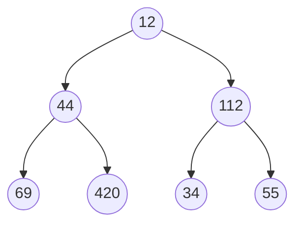

The equivalent level order traversal should be

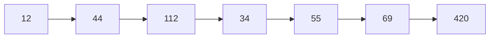
#### Approach
- If you see there is a queuing order, every level of the tree gets processed from left to right.
- Then in the next level they are processed from left to right as well as their parent's order.
- So if we use a queue we can solve this problem.
    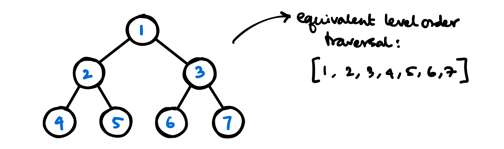
- With queue we can solve this problem, and here is a step by step approach
    


#### Code
```cpp
/**
 * Definition for a binary tree node.
 * struct TreeNode {
 *     int val;
 *     TreeNode *left;
 *     TreeNode *right;
 *     TreeNode() : val(0), left(nullptr), right(nullptr) {}
 *     TreeNode(int x) : val(x), left(nullptr), right(nullptr) {}
 *     TreeNode(int x, TreeNode *left, TreeNode *right) : val(x), left(left), right(right) {}
 * };
 */
class Solution {
public:
    vector<vector<int>> levelOrder(TreeNode* root) {
        
        vector<vector<int>> v;
        
        if (!root) return v;
        
        queue<pair<TreeNode*, int>> q;
        
        int depth = 1;
        q.push({root, depth});
        
        while(!q.empty()){
            TreeNode* front = q.front().first;
            int depth = q.front().second;
            
            q.pop();
            
            if (depth > v.size()) {
                vector<int> v1;
                v1.push_back(front->val);
                v.push_back(v1);
            } else if (depth == v.size()) {
                v[depth - 1].push_back(front->val);
            }
            
            if (front->left) q.push({front->left, depth+1});
            if (front->right) q.push({front->right, depth+1});
        }
        
        return v;
    }
};
```
## N-ary Tree Preorder Traversal
[Problem on Leetcode $\to$](https://leetcode.com/problems/n-ary-tree-preorder-traversal/)
### Problem Statement
Given the root of an n-ary tree, return the preorder traversal of its nodes' values. Nary-Tree input serialization is represented in their level order traversal. Each group of children is separated by the null value (See examples)

### Example
<figure markdown>
{ width="400" }
</figure>
```
Input: root = [1,null,3,2,4,null,5,6]
Output: [1,3,5,6,2,4]
```
<figure markdown>
{ width="400" }
</figure>

```
Input: 
root = [1,null,2,3,4,5,null,null,6,7,null,8,null,9,10,null,null,11,null,12,null,13,null,null,14]
Output: [1,2,3,6,7,11,14,4,8,12,5,9,13,10]
```

### Approach
- We know the approach to find the preorder traversal of a binary tree, there we'd do the root, then left then right
- Instead here we'll do the root, then first from the left, then second from the left and so on until we reach n'th children of the root. So the coding should be pretty simple as following

### Code
```cpp
/*
// Definition for a Node.
class Node {
public:
    int val;
    vector<Node*> children;

    Node() {}

    Node(int _val) {
        val = _val;
    }

    Node(int _val, vector<Node*> _children) {
        val = _val;
        children = _children;
    }
};
*/

class Solution {
private:
    vector<int> order;
public:
    vector<int> preorder(Node* root) {
        if (root) {
            order.push_back(root->val);
            
            for (auto tr:root->children) {
                preorder(tr);
            }
        }
        
        return order;
    }
};
```

## Balanced Binary Tree
[Problem on leetcode $\to$](https://leetcode.com/problems/balanced-binary-tree/)
### Problem Statement
Given a binary tree, determine if it is height-balanced.

### Approach
- If a binary tree is height-balanced then the difference of height of the right subtree and left subtree should not be greater than 2.
- Now from the last problem we can recursivly find the height of the left and right subtrees and check if the difference between them is > 1.
- If at any point we find that the height difference is > 1, we indicate this some how to the main function and say it's not height balanced.

### Code
```cpp
class Solution {
public:
    int height(TreeNode *root) {
        if (!root) return 0;
        
        // recursively find the height of subtrees
        int leftheight = height(root->left);
        int rightheight = height(root->right);
        
        // if we find a height imbalance we inform it to the parent.
        if (std::abs(leftheight - rightheight) > 1) return -1;

        // If [at parent] we find one of the subtrees has height imbalance
        // we return -1 and exit the program
        if (leftheight == -1 or rightheight == -1) return -1;
        
        return 1 + max(leftheight, rightheight);
    }
    
    bool isBalanced(TreeNode* root) {
        // if the subroutine finds anywhere in the tree a height imbalance
        // we return false.
        return height(root) != -1;
    }
};
```

## Branch Sum Problem
### Problem Statement
You'll be given the root node of the binary tree. Now you have to return all the branch's "SUM" in a vector.
### Example:

### Approach
The code should be almost similar to the height finding recursive approach for binary trees. Here we will change the code slightly so that we pass a `int sum` with each recursion and continue to add until we reach the bottom of the tree. 

At leaf node we check if `(tree->left == nullptr and tree->right == nullptr)` then we just push the sum to the answer and return.

### Code
```cpp
void branchSum(vector<int> &v, Tree* tree, int sum) {
    if (tree->left == nullptr and tree->right == nullptr) {
        v.push_back(sum + tree->data);
        return;
    }

    branchSum(v, tree->left, sum+tree->data);
    branchSum(v, tree->right, sum+tree->data);
}

int main(){
    vector<int> v;
    branchSum(v, root, 0);

    for (auto t:v)
        cout << t << " ";
}
```

**Output**
```
INORDER TRAVERSAL OF THE TREE
4 2 5 1 6 3 7 
Branch Sum of TREE
7 8 10 11 
```

## Invert a binary tree
### Problem statement
You'll be given a binary tree, find out the inverted equivalent of the tree. It is prefered to do the inversion in place.

**Example**

Let's say we have a binary tree B. Inverting the binary tree will result into the mirror immage of the tree.


### Apporach

- This is probably one of the best tree questions, it seems that there are a lot of things to track here. So solving this problem requires attention to lot of details.
- The apporach to solve this is to swap the nodes instead of the values.
- First we swap the left node with the right node for the head and then recursively swap the left and right nodes for the left and right nodes.

```cpp
/**
 * Definition for a binary tree node.
 * struct TreeNode {
 *     int val;
 *     TreeNode *left;
 *     TreeNode *right;
 *     TreeNode() : val(0), left(nullptr), right(nullptr) {}
 *     TreeNode(int x) : val(x), left(nullptr), right(nullptr) {}
 *     TreeNode(int x, TreeNode *left, TreeNode *right) : val(x), left(left), right(right) {}
 * };
 */
class Solution {
public:
    TreeNode* invertTree(TreeNode* root) {
        if (root){
            TreeNode* temp = root->left;
            root->left = root->right;
            root->right = temp;
        
            invertTree(root->left);
            invertTree(root->right);
        }
        
        return root;
    }
};
```

### Approach With BFS
I personally don't prefer any recursive approach. With BFS also we can easily solve this problem. We put the node in queue to be processed and when we are at this node if this is not `NULL` we swap it's left and right children.

This is the way we can swap left and right thus inverting it level by level because BFS works level order.
```cpp
class Solution {
public:
    TreeNode* invertTree(TreeNode* root) {
        queue<TreeNode*> q;
        q.push(root);
        
        while(!q.empty()){
            
            TreeNode* thisNode = q.front();   // get front of the queue to process
            q.pop();
            
            
            if (thisNode != nullptr){
                // swap it's left and right
                TreeNode* left = thisNode->left;
                thisNode->left = thisNode->right;
                thisNode->right = left;
                
                q.push(thisNode->left);  // put both the children to be processed later
                q.push(thisNode->right);
            }
        }
        
        return root;
    }
};
```

## Iterative In Order Traversal
As you probably guessed, I don't like to use recursive approaches all that much. In tree traversals you have to iterate over the tree in the following order: $\text{Left} \to \text{Right} \to \text{Root}$.

**Now how can we avoid recursion?** One possible solution could be to use stack and imitate the call stack.

### Code
We should mimic the behavior of the recursion in the recursive implementation of the in order traversal.
```cpp
void iterativeInOrderTraversal(Tree* root){
    vector<Tree*> stack;
    Tree* traveller = root;

    while (true){
        if (traveller != nullptr){
            stack.push_back(traveller);
            traveller = traveller->left;
        } else {
            if (stack.empty()) break;

            traveller = stack.back();
            stack.pop_back();
            cout << traveller->data << " ";
            traveller = traveller->right;
        }
    }
}
```

Now that we've seen the code, we should analyse the code using a dry run.

**This is the starting of the algorithm**. In first step we go left until the first `NULL` is found, and we put all the nodes into the stack so to process later.
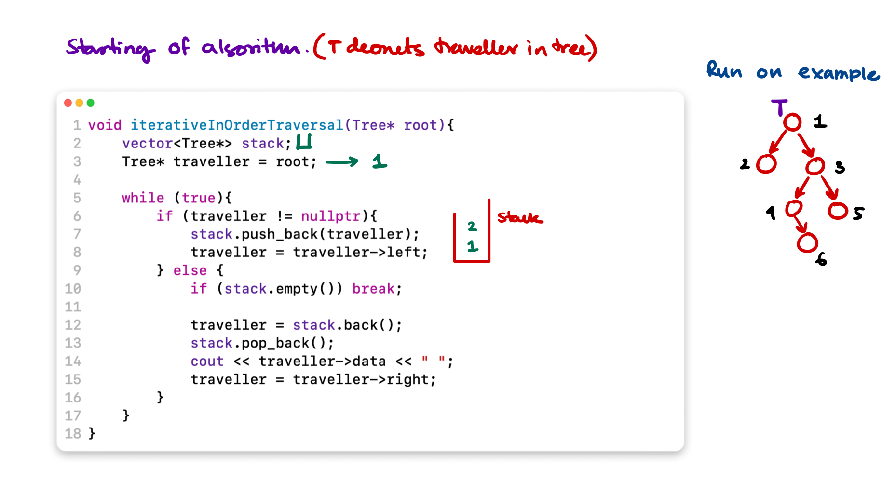

**Now** at this point we've reached the point where we should start processing the node. This node `stack.top()` do not have any left children so for left we don't do anything, and print this node, then we should go to right and process that.


**We keep on deleting from stack and print until we go right** of Node 1.
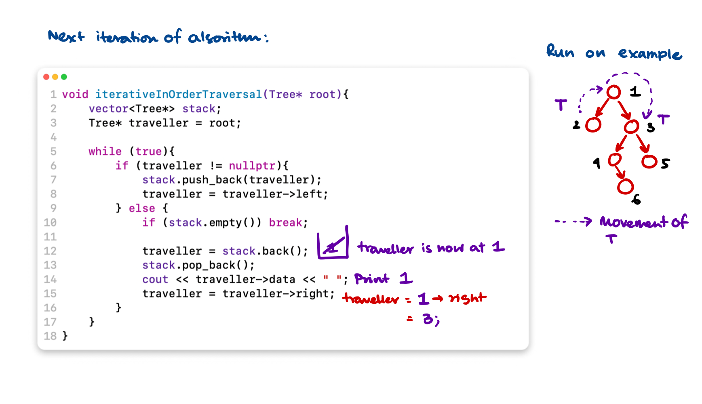

**Now we** reached to a `non-NULL` node so the `if` part will be executed. It will put all the left of `3` into the stack until a `NULL` is reached. 
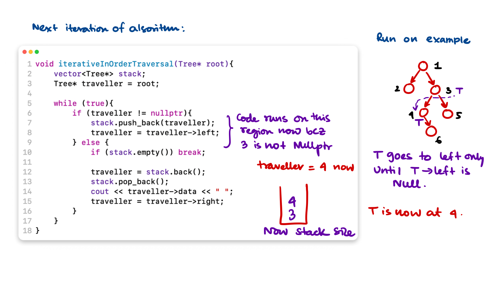
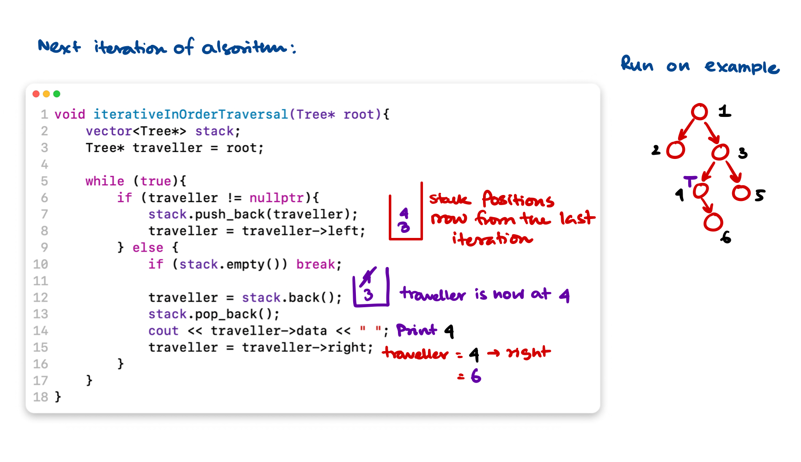
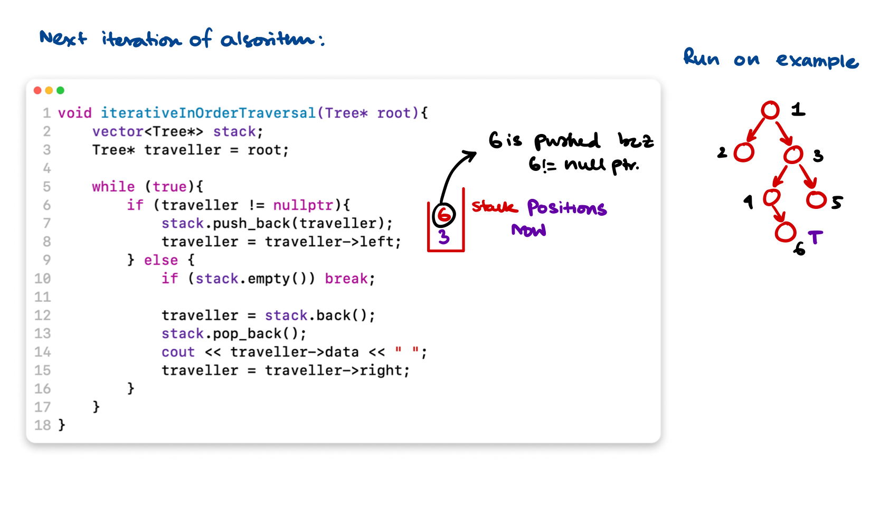

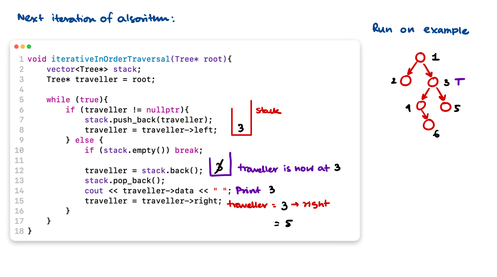

At the very last step $\text{NODE}(5)$ will be processed which I did not show. It's a genuinely good problem and there is a lot to keep track of in the iterative version for a easy recursive problem. 

This goes to show how much the recursion stack actually helps, but at the cost of proper mental gymnastics to come up with a recursive approach.

## Minimum Depth of a Binary Tree
[Find the Problem on Leetcode $\to$](https://leetcode.com/problems/minimum-depth-of-binary-tree/)
### Problem statement
Find the minimum depth of a binary tree. The minimum depth is the number of nodes along the shortest path from the root node to the nearest leaf node.
### Examples:
Depth = Path of 1 $\to$ 3. So the code should return 2.
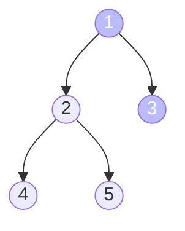

Depth = Path of 12 $\to$ 7 $\to$ 9. So the code should return 3.

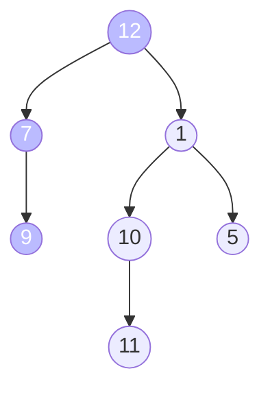
### Approach
- This is a pattern related to breath first search traversal.
- Think of this logically, if you traverse level by level and you find the first node that is a leaf node. This means you found the shallowest node in the binary tree.
- You track and return the depth of that shallowest node.
### C++ Code
```cpp
/**
 * Definition for a binary tree node.
 * struct TreeNode {
 *     int val;
 *     TreeNode *left;
 *     TreeNode *right;
 *     TreeNode() : val(0), left(nullptr), right(nullptr) {}
 *     TreeNode(int x) : val(x), left(nullptr), right(nullptr) {}
 *     TreeNode(int x, TreeNode *left, TreeNode *right) : val(x), left(left), right(right) {}
 * };
 */
class Solution {
public:
    int minDepth(TreeNode* root) {
        
        if (!root) return 0;
        
        queue<pair<TreeNode*, int>> q;
        
        int depth = 1;
        
        q.push({root, 1});
        
        while(!q.empty()){
            TreeNode* front = q.front().first;
            int nextDepth = q.front().second + 1;
            
            q.pop();
            
            if (front->left) q.push({front->left, nextDepth});
            if (front->right) q.push({front->right, nextDepth});
            if (!front->left and !front->right) return nextDepth - 1;
            
            depth = nextDepth;
        }
        
        return depth;
    }
};
```

## Connect Level Order Siblings

[Find the Problem on Leetcode $\to$](https://leetcode.com/problems/populating-next-right-pointers-in-each-node/)

### Problem statement
Given a binary tree, connect each node with its level order successor. The last node of each level should point to a null node in place.

A **new** `next` attribute is added to the tree structure. Update the `next` in-place.
### Example


### Approach With Extra Space
- We store level wise node references in a `vector<vector<Node *>>` using BFS and a modified queue,
- then we link them together. To maintain the `vector<vector<Node *>>` we need $O(N)$ Space.

#### Code for this approach
```cpp
/*
// Definition for a Node.
class Node {
public:
    int val;
    Node* left;
    Node* right;
    Node* next;

    Node() : val(0), left(NULL), right(NULL), next(NULL) {}

    Node(int _val) : val(_val), left(NULL), right(NULL), next(NULL) {}

    Node(int _val, Node* _left, Node* _right, Node* _next)
        : val(_val), left(_left), right(_right), next(_next) {}
};
*/

class Solution {
public:
    Node* connect(Node* root) {
        
        if (!root) return root;
        
        queue<pair<Node*, int>> q;
        vector<vector<Node*>> v;
        
        int depth = 1;
        q.push({root, depth});
        
        while(!q.empty()) {
            Node* front = q.front().first;
            int depth = q.front().second;
            
            q.pop();
            
            if (depth > v.size()) {
                vector<Node*> v1;
                v1.push_back(front);
                v.push_back(v1);
            } else if (depth == v.size()) {
                v[depth - 1].push_back(front);
            }
            
            if (front->left) q.push({front->left, depth + 1});
            if (front->right) q.push({front->right, depth + 1});
            
        }

        // for each level of nodes process the next attribute and set to its neighbors.
        
        for (auto level:v) {
            int size = level.size();
            int index = 0;
            
            while(index < size - 1){
                level[index] -> next = level[index + 1];
                index++;
            }
            
            level[index]->next = nullptr;
        }
        
        return root;
    }
};
```

### Approach with a bit less space

[Question on Leetcode $\to$](https://leetcode.com/problems/path-sum)

In this approach, instead of storing the level wise ordering in a vector of vectors, we simply link the nodes as we go by just keeping one reference to the previously processed node. But still we have to keep the queue in order to run the BFS. So the extra space is actually needed which is $\text{MAX(WIDTH of TREE)}$.

#### Code for this approach
- We'll enqueue next level nodes in right to left order, then connect them with each other.
```cpp
class Solution {
public:
    Node* connect(Node* root) {
        if (not root) return nullptr;
        queue<Node*> q;
        q.push(root);
        
        while (not q.empty()) {
            Node* right = nullptr;
            int queue_size = q.size();

            for (int i=queue_size; i>0; i--) {
                Node* front = q.front();
                front->next = right;
                right = front;
                q.pop();
                
                // add the siblings in reverse order
                if (front->right) q.push(front->right);
                if (front->left) q.push(front->left);
            }
        }
        
        return root;
    }
};
```

## Binary Tree Path Sum
### Problem Statement
Given a binary tree and a number ‘S’, find if the tree has a path from root-to-leaf such that the sum of all the node values of that path equals ‘S’.

### Example
1. **Path Sum** = $28$. **Output** = TRUE.
2. **Path Sum** = $21$. **Output** = False. No path in the following tree has sum 21.

### Code approach 1
- We recursively go in depth first search and check if the sum is matching with the path,
- if yes we return `true`.


```cpp
class Solution {
public:
    bool hasPathSum(TreeNode* root, int targetSum) {
        
        if (!root) return false;
               
        if (!root->left and !root->right) {
            if (targetSum == root->val) {
                return true;
            }
        }
        
        return hasPathSum(root->left, targetSum - root-> val) || hasPathSum(root->right, targetSum - root-> val);
    }
};
```

### Code approach 2
It has a separate private boolean variable `a` which can even be modified to store how many times a path sum target is met.
```cpp
class Solution {
private:
    bool a[2] = {false, false};
public:
    bool hasPathSum(TreeNode* root, int targetSum) {
        if (!root) return false;
        
        if (not root->left and not root->right) {
            if (root->val == targetSum) {
                a[0] = true;
                a[1] = true; // sets if at least 1 true occurred
            } else {
                a[0] = false; // resets to false if some branch did not cut it
            }
        }
        
        hasPathSum(root->left, targetSum-root->val);
        hasPathSum(root->right, targetSum-root->val);
        
        return a[0] || a[1];
    }
};
```

## Count All Paths for a Sum
In the previous example we checked if some path contains the sum or not? but here find all paths from root-to-leaf such that the sum of all the node values of each path equals ‘S’. Return the count of paths matching the sum.

### Approach
Approach is the same as the previous approach's code #$2$, with a little modification. Instead of marking true if some path gives a match we'll update some counter.
### Code
```cpp
class Solution {
private:
    pair<bool, int> a = {false, 0}; // instead we put a counter in there.
public:
    int countPathSum(TreeNode* root, int targetSum) {
        if (!root) return false;
        
        if (not root->left and not root->right) {
            if (root->val == targetSum) {
                a.first = true;
                a.second += 1; // updates per target sum occurrences.
            } else {
                a.first = false; // resets to false if some branch did not cut it
            }
        }
        
        countPathSum(root->left, targetSum-root->val);
        countPathSum(root->right, targetSum-root->val);
        
        return a.second;
    }
};
```

## Traceout All Paths for a Sum
It is the same as the previous problem but here you have to return the path where the sum is matching. Return a `vector<vector<Tree*>>`. Given the root of a binary tree and an integer targetSum, return all root-to-leaf paths where the sum of the node values in the path equals targetSum. Each path should be returned as a list of the node values, not node references.

A root-to-leaf path is a path starting from the root and ending at any leaf node. A leaf is a node with no children.

[**Same Problem on Leetcode** $\to$](https://leetcode.com/problems/path-sum-ii/)

### Example
Target sum for the following tree: $34$
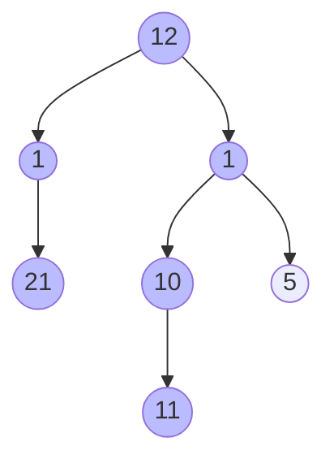

Paths that returns $34$ are the following:

- $12 \to 1 \to 21$
- $12 \to 1 \to 10 \to 11$

So these 2 path should be returned as the function finishes.

### Approach
- We create 2 vectors: one `vector<vector<Tree*>>` and one `vector<Tree*>`, the second one `vector<Tree*>` will be unique for each recursion level,
- When we traverse the tree Depth First we put the nodes into `vector<Tree*>`,
- When we reach the leaf node we check if the sum is matchting with the desired path sum. If yes we record the path sum.

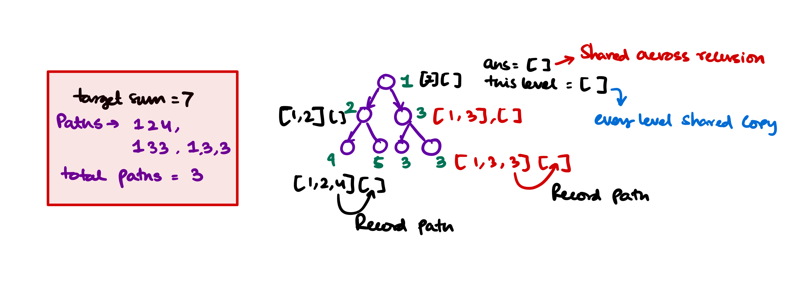

### Code
```cpp
/**
 * Definition for a binary tree node.
 * struct TreeNode {
 *     int val;
 *     TreeNode *left;
 *     TreeNode *right;
 *     TreeNode() : val(0), left(nullptr), right(nullptr) {}
 *     TreeNode(int x) : val(x), left(nullptr), right(nullptr) {}
 *     TreeNode(int x, TreeNode *left, TreeNode *right) : val(x), left(left), right(right) {}
 * };
 */
class Solution {
public:
    vector<vector<int>> pathSum(TreeNode* root, int targetSum) {
        vector<int> thisLevel;
        vector<vector<int>> answer;
        
        // recursively go dfs
        helper(root, targetSum, thisLevel, answer);
        
        return answer;
    }
    
    void helper(TreeNode* root, int targetSum, vector<int> thisLevel, vector<vector<int>> &answer){
        if (!root) return;
        
        thisLevel.push_back(root->val);
        
        if (not root->left and not root->right) {
            if (targetSum == root->val) {
                // means this path sum is exactly the targetSum
                // record the path
                answer.push_back(thisLevel);
            }
        }
        
        helper(root->left, targetSum - root->val, thisLevel, answer);
        helper(root->right, targetSum - root->val, thisLevel, answer);
    }
};
```

## Validate a Binary Search Tree
[Problem on Leetcode $\to$](https://leetcode.com/problems/validate-binary-search-tree/)
### Problem Statement
Given a binary tree check if the binary tree conforms to the criteria for a binary search tree.

### Approach
1. Given a binary tree (with unit node) it is always considered a binary search tree.
2. Given a binary tree with one unit left node and unit right node, if $\text{Val(left)} \leq \text{Val(parent)} \leq \text{Val(right)}$ then it is a binary search tree.
3. Given a binary tree with left subtree and right subtree, it is considered a binary search tree if both the left and right subtrees are binary search trees and condition 2 satisfies.
4. Using these 3 steps we can determine if the binary tree is binary search tree.
5. But using only these three steps can not independently determine if the binary tree is binary search tree? For example in the following tree, all the elements to the right subtree of the Node $10$ must be greater than $10$. But the first $3$ steps of the algorithm only checks for local violations.
    ```mermaid
    graph TD

        subgraph With No local and global violation
        10a((10)) --> 5a((5)) & 15((15))
        5a --> 2((2)) & 5b((6))
        2 --> 1a((1)) & null1((null))
        15 --> 13((13)) & 22((22))
        13 --> null12((null)) & 14((14))
        end

        subgraph With Global violation at 3
        10((10)) --> 1((1)) & 4((4))
        4      --> 3((3)) & 6((6))
        end
    ```
6. If we look closely all the elements of right subtree for 10 the for tree with no local violation, has the value $\gt 10$ so minimum for such elements in the right subarray is at least $\gt 10$. And there is no max limit as such for any element in the right subtree. But once we fix the right of $10$ as $15$ then the left of $15$ can have the maximum value at most $14$ (because all are integers) and at minimum $11$ because it is on the right of 10. 
7. So now let's analyse for all nodes what can be the maximum and what can be the minimum value. Then if we recursively check we should check for Binary Search Tree property.

**Below this is a tree and for each nodes the minumum and maximum is calculated**


**From** the diagram we can see that when we travel to left, the minimum for the *left* children is $\text{Parent.Minimum}$ and the maximum is $\text{Parent.Value}$. When we travel to right, the minimum for the *right* children is $\text{Parent.Value}$ and the maximum is $\text{Parent.Maximum}$.

- So upon travel to left, bound for left's value is $\text{Min} = \text{Parent.Min}$ and $\text{Max} = \text{Parent.Value}$
- Upon travel to right, bound for right's value is $\text{Min} = \text{Parent.Value}$ and $\text{Max} = \text{Parent.Maximum}$

Now let's transfer it into a working C++ Code.
### Code
```cpp
/**
 * Definition for a binary tree node.
 * struct TreeNode {
 *     int val;
 *     TreeNode *left;
 *     TreeNode *right;
 *     TreeNode() : val(0), left(nullptr), right(nullptr) {}
 *     TreeNode(int x) : val(x), left(nullptr), right(nullptr) {}
 *     TreeNode(int x, TreeNode *left, TreeNode *right) : val(x), left(left), right(right) {}
 * };
 */

class Solution {
private:
    bool subRoutine (TreeNode* root, long minim, long maxim) {
        if (!root) return true;
        
        long valueHere = root->val;
        bool thisLevel = false;
        
        if (minim < valueHere and valueHere < maxim) thisLevel = true;
        bool isLeft = subRoutine(root->left, minim, root->val);
        bool isRight = subRoutine(root->right, root->val, maxim);
        
        return thisLevel && isLeft && isRight;
    }
    
public:
    bool isValidBST(TreeNode* root) {
        return subRoutine(root, LONG_MIN, LONG_MAX);
    }
};
```

## Find Kth Largest value in the binary search tree
[Problem On Leetcode $\to$](https://leetcode.com/problems/kth-smallest-element-in-a-bst/)
### Problem Statement
Given a binary search tree find the kth largest value accross all the nodes in the tree.

### Approach
We should traverse the tree in-order, so the values encountered are in non descending order. Now we count until we reach kth smallest value. We record the kth smallest value in some variable and return.

### Code
```cpp
class Solution {
private:
    int treeNodeCount = 1; // starting index is 1
    int setValue; // should hold the kth smallest value
public:
    int kthSmallest(TreeNode* root, int k) {
        if (root) {
            kthSmallest(root->left, k);
            
            if (treeNodeCount == k) {
                setValue = root->val; // set the kth smallest value
            }
            
            treeNodeCount++;
            kthSmallest(root->right, k);
        }
        
        return setValue;
    }
};
```

### Time and memory complexity
- We are essentially traversing in-order so the it's $O(N)$
- Extra memory is $O(1)$. For usage of recursive function calls we need at least $O(\lg N)$ (height of the tree) auxiliary space.

## Find the total number of Binary Search Trees possible
[Find the Problem on Leetcode $\to$](https://leetcode.com/problems/unique-binary-search-trees/)
### Problem Statement
Given an integer n, return the number of structurally unique BST's (binary search trees) which has exactly n nodes of unique values from 1 to n.
### Approach
It's the nth catalan number which represents the number of structures possible with upto n nodes. Now for each structure there can be only one inorder traversal which represents to a sorted order. So n'th catalan number is the answer.

### Code
```cpp
class Solution {
private:
    unsigned long int catalan(int n) {
        
        vector<unsigned long int> catalanTable;
        catalanTable.push_back(1); // catalan(0)
        catalanTable.push_back(1); // catalan(1)
        
        for (int i=2; i<=n; i++) {
            catalanTable.push_back(0);
            for (int j = 0; j < i; j++)
                catalanTable[i] += catalanTable[j] * catalanTable[i - j - 1];
        }
        
        return catalanTable.back();
    }
public:
    int numTrees(int n) {
        // catalan's number is the answer
        return (int) catalan(n);
    }
};
```

## Same Binary Search Tree
### Problem Statement
You are given 2 sequences of numbers. Find out if you put numbers in a binary search tree in those 2 orders it'll be the same binary search tree. The caveat is that you can't construct the tree yourself and compare using some tree traversal techniques.

### Input Format
You'll be given 2 binary search tree insertion order in 2 `vector<int>`. This is the order you are expected to insert into the binary search tree. Compare both and return `true` if the binary search trees are essentially the same.

### Example
`vector<int> v1 = {10, 15, 8, 12, 94, 81, 5, 2, 11};` and `vector<int> v2 = {10, 8, 5, 15, 2, 12, 11, 94, 81}` inserting using v1 order and v2 order will result in the same binary search tree, so the function will return `true`.

### Approach
If we look closely we'll see that the binary search tree is constructed uniquely if all the elements coming to left of the root element (10) is in the same order in both the cases. The elements that is greater than the root element (10) will not interfere with the left subtree of the binary search tree.

So we compare the order of elements < root (10) and compare order of elements > root (10). If the order are same then both must be the same binary search tree.

### Time and Space complexity
No extra space is required, the algorithm runs in $O(n)$ time.

## Binary Search Tree Iterator
[Problem on Leetcode $\to$](https://leetcode.com/problems/binary-search-tree-iterator/)
### Problem Statement
Implement the BSTIterator class that represents an iterator over the in-order traversal of a binary search tree (BST):

- `BSTIterator(TreeNode root)` Initializes an object of the BSTIterator class. The root of the BST is given as part of the constructor. The pointer should be initialized to a non-existent number smaller than any element in the BST.
- `boolean hasNext()` Returns true if there exists a number in the traversal to the right of the pointer, otherwise returns false.
- int `next()` Moves the pointer to the right, then returns the number at the pointer.


Notice that by initializing the pointer to a non-existent smallest number, the first call to `next()` will return the smallest element in the BST.

You may assume that `next()` calls will always be valid. That is, there will be at least a next number in the in-order traversal when `next()` is called.

### Approaches
#### Straight forward apporach
A straight forward solution is to build the in-order traversal when the binary search tree is constructed. Then solve the `next()` and `hasNext()` problem accordingly.

#### Code with Straight Forward Apporach
```cpp
class BSTIterator {
private:
    vector<int> inOrder;
    int current;
    
    void makeInOrder(TreeNode* root) {
        if (root) {
            makeInOrder(root->left);
            inOrder.push_back(root->val);
            makeInOrder(root->right);
        }
    }
    
public:
    BSTIterator(TreeNode* root) {
        // Make the in-order traversal beforehand
        makeInOrder(root);
        
        current = -1; // start with -1
        // so when first next() is called we return the root
    }
    
    int next() {
        current++;
        return inOrder[current];
    }
    
    bool hasNext() {
        if (current == inOrder.size() - 1) {
            return false;
        }
        return true;
    }
};
```

## Count Complete Tree Nodes
[Problem on Leetcode $\to$](https://leetcode.com/problems/count-complete-tree-nodes/)

### Problem statement
Given the root of a complete binary tree, return the number of the nodes in the tree.

According to Wikipedia, every level, except possibly the last, is completely filled in a complete binary tree, and all nodes in the last level are as far left as possible. It can have between 1 and 2h nodes inclusive at the last level h.

Design an algorithm that runs in less than O(n) time complexity.

### Approach
We can easily solve this problem with recursion but as in this problem sub-trees of the binary tree is complete binary tree we can use the formula to calculate the number of nodes as $2^{\text{height}}$. This way the overall time complexity reduces.

Otherwise if $O(N)$ is possible we could just run an in order traversal algorithm to find the number of nodes in the tree.

### Code
```cpp
/**
 * Definition for a binary tree node.
 * struct TreeNode {
 *     int val;
 *     TreeNode *left;
 *     TreeNode *right;
 *     TreeNode() : val(0), left(nullptr), right(nullptr) {}
 *     TreeNode(int x) : val(x), left(nullptr), right(nullptr) {}
 *     TreeNode(int x, TreeNode *left, TreeNode *right) : val(x), left(left), right(right) {}
 * };
 */
class Solution {
private:
    
    int two_pow(int n) {
        // find 2^n
        int result=1;
        while (n!=0) {
            result *= 2;
            n--;
        }
        
        return result;
    }
    
    int lh(TreeNode* root) {
        // find left height of a given tree
        if (!root) return 0;
        return 1 + lh(root->left);
    }
    
    int rh(TreeNode* root) {
        // find right height of a given tree
        if (!root) return 0;
        return 1 + rh(root->right);
    }
    
    int count(TreeNode* root) {
        int leftHeight = lh(root);
        int rightHeight = rh(root);
        
        // if both left and right height is the same then
        // with respect to the root at current recursion level it is balanced and complete
        // so the number of node will be 2^n - 1
        if (leftHeight == rightHeight) {
            return two_pow(leftHeight) - 1;
        }

        // else we continue with the normal recursive counting
        return 1 + count(root->left) + count(root->right);
    }
    
public:
    int countNodes(TreeNode* root) {
        if (not root) return 0;
        return count(root);
    }
};
```

## Deepest Leaves Sum
[Problem on Leetcode $\to$](https://leetcode.com/problems/deepest-leaves-sum/)

### Problem Statemet
Given the root of a binary tree, return the sum of values of its deepest leaves.

### Approach
We shoud use my BFS technique with passing depth. Using this technique

- when we find a leaf node we store it in a `pair<int, int>` and save the depth.
- If we find a leaf node less than this depth, so this can not be in the answer so we ignore it.
- If we find a leaf node is at the same level this means it can be included in the answer and later if we find any node at a deeper depth we'll discard all the calculations before.

So here is the code using the upper approach

```cpp
/**
 * Definition for a binary tree node.
 * struct TreeNode {
 *     int val;
 *     TreeNode *left;
 *     TreeNode *right;
 *     TreeNode() : val(0), left(nullptr), right(nullptr) {}
 *     TreeNode(int x) : val(x), left(nullptr), right(nullptr) {}
 *     TreeNode(int x, TreeNode *left, TreeNode *right) : val(x), left(left), right(right) {}
 * };
 */
class Solution {
public:
    pair<int, int> sumAndDepth = {0,0};
    int deepestLeavesSum(TreeNode* root) {
        queue<pair<TreeNode*, int>> q;
        
        // set root node at depth 1
        q.push({root, 1});
        
        while (!q.empty()) {
            TreeNode* front = q.front().first;
            int depth = q.front().second;
            
            q.pop();
            
            if (not front->left and not front->right) {
                // it is a leaf node
                if (depth == sumAndDepth.second) {
                    // if the leaf node is at 'presumably' the deepest node
                    // add the values
                    sumAndDepth.first += front->val;
                    sumAndDepth.second = depth;
                } else if (depth > sumAndDepth.second) {
                    // else if some other node is at a greater depth
                    // reset the depth and sum
                    sumAndDepth.first = 0 + front->val;
                    sumAndDepth.second = depth;
                }
            }
            
            // simple BFS strategy
            if (front->left) q.push({front->left, depth+1});
            if (front->right) q.push({front->right, depth+1});
        } 
        
        return sumAndDepth.first;    // return the sum at the last
    }
};
```

## Sum of Nodes with Even-Valued Grandparent
[Problem on Leetcode $\to$](https://leetcode.com/problems/sum-of-nodes-with-even-valued-grandparent/)
### Problem Statement
Given the root of a binary tree, return the sum of values of nodes with an even-valued grandparent. If there are no nodes with an even-valued grandparent, return 0.

A grandparent of a node is the parent of its parent if it exists.

### Approach
It's a simple recursive problem, we'll get to every node and check if it is even then if it has a grandparent. Every node has 4 possible grand-children:

- left of left children,
- right of left children,
- right of right children,
- left of right children,

With that apporach let's code

### Code
```cpp
class Solution {
private:
    int sum = 0;
public:
    int sumEvenGrandparent(TreeNode* root) {
        if (root) {

            if (root->val % 2 == 0) {
                
                // if even number check all the grandchildren
                if (root->left) {
                    if (root->left->left) {
                        sum +=root->left->left->val;
                    }
                    
                    if (root->left->right) {
                        sum +=root->left->right->val;
                    }
                }
                
                if (root->right) {
                    
                    if (root->right->left) {
                        sum +=root->right->left->val;
                    }
                    
                    if (root->right->right) {
                        sum +=root->right->right->val;
                    }
                }
            }
            
            sumEvenGrandparent(root->left);
            sumEvenGrandparent(root->right);
        }
        
        return sum;
    }
};
```

## Same Tree
[Problem on Leetcode $\to$](https://leetcode.com/problems/same-tree/)
### Problem Statement
Given the roots of two binary trees p and q, write a function to check if they are the same or not.

Two binary trees are considered the same if they are structurally identical, and the nodes have the same value.

### Example
```
Input: p = [1,2,3], q = [1,2,3]
Output: true
```

### Approach
- We'll go through both the tree with a simultaneous in-order traversal, if we find any incorrect order we'll report false.

### Code
```cpp
/**
 * Definition for a binary tree node.
 * struct TreeNode {
 *     int val;
 *     TreeNode *left;
 *     TreeNode *right;
 *     TreeNode() : val(0), left(nullptr), right(nullptr) {}
 *     TreeNode(int x) : val(x), left(nullptr), right(nullptr) {}
 *     TreeNode(int x, TreeNode *left, TreeNode *right) : val(x), left(left), right(right) {}
 * };
 */
class Solution {
public:
    bool isSameTree(TreeNode* p, TreeNode* q) {
        if (not p and not q) return true;
        
        if (p and q) {
            return (p->val == q->val) and isSameTree(p->left, q->left) and isSameTree(p->right, q->right);
        }
        
        return false;
    }
};
```

## Flatten Binary Tree to Linked List
[Find Problem on Leetcode $\to$](https://leetcode.com/problems/flatten-binary-tree-to-linked-list/)
### Problem Statement
Given the root of a binary tree, flatten the tree into a "linked list":

- The "linked list" should use the same TreeNode class where the right child pointer points to the next node in the list and the left child pointer is always null.
- The "linked list" should be in the same order as a pre-order traversal of the binary tree.

### Approach
- We have to solve this using a recursive approach, otherwise, the problem will become too complicated to solve because then you also have to keep track of the call stack.
- In recursion, we'll assume we have a `leftEnd` and `rightEnd` after the recursion, for any given root of the binary tree `leftEnd` is the flattened `root->left` of that root.
- Now as per the problem statement we set the following three
    - `leftEnd->right = root->right;`
    - `root->right = root->left;`
    - `root->left = nullptr;`
- and now at the end, we return the `__End`, which is used recursively to connect the flattened binary tree. We'll return the `rightEnd` if possible else the `leftEnd` or `root`.


### Code
```cpp
/**
 * Definition for a binary tree node.
 * struct TreeNode {
 *     int val;
 *     TreeNode *left;
 *     TreeNode *right;
 *     TreeNode() : val(0), left(nullptr), right(nullptr) {}
 *     TreeNode(int x) : val(x), left(nullptr), right(nullptr) {}
 *     TreeNode(int x, TreeNode *left, TreeNode *right) : val(x), left(left), right(right) {}
 * };
 */
class Solution {
private:
    TreeNode* recursive_descent(TreeNode* root) {
        if (root) {
            TreeNode* leftEnd = recursive_descent(root->left);
            TreeNode* rightEnd = recursive_descent(root->right);
            
            if (root->left) {
                leftEnd->right = root->right;
                root->right = root->left;
                root->left = nullptr;
            }
            
            if (rightEnd) return rightEnd;
            else if (not rightEnd and leftEnd) return leftEnd;
            else return root;
        }
        
        return nullptr;
    }
public:
    void flatten(TreeNode* root) {
        recursive_descent(root);
    }
};
```

## Lowest Common Ancestor of a Binary Search Tree
### Problem Statement
Given a binary search tree (BST), find the lowest common ancestor (LCA) of two given nodes in the BST.

According to the definition of LCA on Wikipedia: “The lowest common ancestor is defined between two nodes p and q as the lowest node in T that has both p and q as descendants (where we allow a node to be a descendant of itself).”

### Approach
- We'll use a simple recursive technique to find the lowest common ancestor, if the node `p` and node `q` are in different subtrees from a certain root, then it is must that the root is the lowest common ancestor.
- If we find the both the node `p` and node `q` are in the same subtree, we'll recursively descent into that subtree in search for the lowest common ancestor.

### Code
```cpp
/**
 * Definition for a binary tree node.
 * struct TreeNode {
 *     int val;
 *     TreeNode *left;
 *     TreeNode *right;
 *     TreeNode(int x) : val(x), left(NULL), right(NULL) {}
 * };
 */

class Solution {
    bool findOnSubTree(TreeNode* root, TreeNode* q) {

        if (root) {
            return findOnSubTree(root->left, q) or (root->val == q->val) or findOnSubTree(root->right, q);
        }
        
        return false;
    }
public:
    TreeNode* lowestCommonAncestor(TreeNode* root, TreeNode* p, TreeNode* q) {
        // check if both in the same tree or not?
        // recursively go to that subtree only
        if (findOnSubTree(root->left, p) and findOnSubTree(root->left, q)) {
            return lowestCommonAncestor(root->left, p , q);
        } else if (findOnSubTree(root->right, p) and findOnSubTree(root->right, q)) {
            return lowestCommonAncestor(root->right, p , q);
        }
        
        // both in different sub-tree
        return root;
    }
};
```

### Another approach
We can also take on the fact that we have a binary search tree, so we can say that if we start at the root node of the tree then if p and q value both are less than the root we search in the left subtree and if p and q value both are greater than the root node we search in the right subtree. Any case other than that, means values have split between left and right subtrees from that position, that means this is the lowest common ancestor. So return that.

### Code for this approach
```cpp
class Solution {
public:
    TreeNode* lowestCommonAncestor(TreeNode* root, TreeNode* p, TreeNode* q) {
        TreeNode* current = root;
        
        while (current) {
            if (p->val < current->val and q->val < current->val) {
                current = current->left;
            } else if (p->val > current->val and q->val > current->val) {
                current = current->right;
            } else {
                return current;
            }
        }
        
        // base case of all
        return root;
    }
};
```

## Maximum Product of Splitted Binary Tree
[Find the problem on Leetcode $\to$](https://leetcode.com/problems/maximum-product-of-splitted-binary-tree/)
### Problem Statement
Given the root of a binary tree, split the binary tree into two subtrees by removing one edge such that the product of the sums of the subtrees is maximized.

Return the maximum product of the sums of the two subtrees. Since the answer may be too large, return it modulo $10^9 + 7$.

Note that you need to maximize the answer before taking the mod and not after taking it.

### Examples

```
Input: root = [1,2,3,4,5,6]
Output: 110
Explanation: Remove the red edge and get 2 binary trees with sum 11 and 10. Their product is 110 (11*10)
```


```
Input: root = [1,null,2,3,4,null,null,5,6]
Output: 90
Explanation: Remove the red edge and get 2 binary trees with sum 15 and 6.Their product is 90 (15*6)
```

### Approach
- We'll find the sum in each of the subtrees. If we know the sum of a subtree, the answer is `max( (total_sum - subtree_sum) * subtree_sum)` in each node.
- To find the `total_sum` we run a subroutine `helper()` that'll find the sum with post order traversal.
- At the end keep track of the max of `max( (total_sum - subtree_sum) * subtree_sum)` for each of the subtrees for every node.

### Code
```cpp
/**
 * Definition for a binary tree node.
 * struct TreeNode {
 *     int val;
 *     TreeNode *left;
 *     TreeNode *right;
 *     TreeNode() : val(0), left(nullptr), right(nullptr) {}
 *     TreeNode(int x) : val(x), left(nullptr), right(nullptr) {}
 *     TreeNode(int x, TreeNode *left, TreeNode *right) : val(x), left(left), right(right) {}
 * };
 */
class Solution {
private:
    int M = 1e9 + 7;
    long long max_prod = 0;
    
    int helper(TreeNode* root) {
        int total = 0;
        if (not root) return 0;
        total += root->val + helper(root->left) + helper(root->right);
        
        return total;
    }
    
    int subroutine(TreeNode* root, int total) {
        if (not root) return 0;
        int sum = root->val;
        int left = subroutine(root->left, total);
        int right = subroutine(root->right, total);
        
        sum = sum + left + right;
        
        max_prod = std::max(max_prod, (left*1LL) * ((total - left)*1LL));
        max_prod = std::max(max_prod, (right*1LL) * ((total - right)*1LL));
        
        return sum;
    }

public:
    int maxProduct(TreeNode* root) {
        int total = helper(root);
        subroutine(root, total);
        return max_prod % M;
    }
};
```

## Count Good Nodes in Binary Tree
[Find the problem on Leetcode $\to$](https://leetcode.com/problems/count-good-nodes-in-binary-tree/)
### Problem Statement
Given a binary tree root, a node X in the tree is named **good** if in the path from root to X there are no nodes with a value greater than X.

Return the number of **good** nodes in the binary tree.

### Example
<figure markdown>
{ width="300" }
</figure>
```
Input: root = [3,1,4,3,null,1,5]
Output: 4
Explanation: Nodes in blue are good.
Root Node (3) is always a good node.
Node 4 -> (3,4) is the maximum value in the path starting from the root.
Node 5 -> (3,4,5) is the maximum value in the path
Node 3 -> (3,1,3) is the maximum value in the path.
```

### Approach
- We'll send a `maxSeen` so far variable down with the recursive calls. If we find a node with value greater or equal to the current node we'll increment the counter of **good** notes.
- At last we'll return the `good_node_counter` global variable.

### Code
```cpp
/**
 * Definition for a binary tree node.
 * struct TreeNode {
 *     int val;
 *     TreeNode *left;
 *     TreeNode *right;
 *     TreeNode() : val(0), left(nullptr), right(nullptr) {}
 *     TreeNode(int x) : val(x), left(nullptr), right(nullptr) {}
 *     TreeNode(int x, TreeNode *left, TreeNode *right) : val(x), left(left), right(right) {}
 * };
 */
class Solution {
private:
    int good_node_counter = 0;
    
    void recursive_subroutine(TreeNode* root, int maxSeen) {
        if (not root) return;
        
        if (root->val >= maxSeen) {
            good_node_counter++;
        }
        
        maxSeen = std::max(maxSeen, root->val);
        
        recursive_subroutine(root->left, maxSeen);
        recursive_subroutine(root->right, maxSeen);
    }
public:
    int goodNodes(TreeNode* root) {
        recursive_subroutine(root, root->val);
        return good_node_counter;
    }
};
```

## Trim a Binary Search Tree
[Find the Problem on Leetcode $\to$](https://leetcode.com/problems/trim-a-binary-search-tree/)
### Problem Statement
Given the root of a binary search tree and the lowest and highest boundaries as low and high, trim the tree so that all its elements lies in [low, high]. Trimming the tree should not change the relative structure of the elements that will remain in the tree (i.e., any node's descendant should remain a descendant). It can be proven that there is a unique answer.

Return the root of the trimmed binary search tree. Note that the root may change depending on the given bounds.

### Example
<figure markdown>
{ width="400" }
</figure>
```
Input: root = [1,0,2], low = 1, high = 2
Output: [1,null,2]
```

<figure markdown>
{ width="400" }
</figure>

```
Input: root = [3,0,4,null,2,null,null,1], low = 1, high = 3
Output: [3,2,null,1]
```

### Approach
We'll do a recursive descent into the binary search tree. As it is a binary search tree we can find the way to go down the recursion based on the values at the current node.

Few of the moves that we'll be taking during the recursion are the following

- If some `root->left->val` is less than the low means that the current node's left child should become the current node's left's right child (making all the `left->left->right&left` invalid because they will be less than the lower bound on the binary search tree). Even then there can be a problem that the new `left` of the current node is out of bounds again. So we recursively call the function on that same node again.
- After this when we are done correcting the `node` there may be a chance that some of the children are not corrected yet, so we recursively call the function on the left children `trimBST(root->left, low, high);`.
- We symmatically solve the right children.
- This is how we solved the left and the right children but we didn't solved the current root yet. To solve this we'll do a simple recursive return from the left or the right depending upon the value at the root node.
    ```cpp
    if (root->val < low) return trimBST(root->right, low, high);
    if (root->val > high) return trimBST(root->left, low, high);    
    ```

### Code
```cpp
/**
 * Definition for a binary tree node.
 * struct TreeNode {
 *     int val;
 *     TreeNode *left;
 *     TreeNode *right;
 *     TreeNode() : val(0), left(nullptr), right(nullptr) {}
 *     TreeNode(int x) : val(x), left(nullptr), right(nullptr) {}
 *     TreeNode(int x, TreeNode *left, TreeNode *right) : val(x), left(left), right(right) {}
 * };
 */
class Solution {
public:
    TreeNode* trimBST(TreeNode* root, int low, int high) {
        if (not root) return root;
        
        if (root->left and root->left->val < low) {
            root->left = root->left->right;
            trimBST(root, low, high);
        }
        
        trimBST(root->left, low, high);
        
        if (root->right and root->right->val > high) {
            root->right = root->right->left;
            trimBST(root, low, high);
        }
        
        trimBST(root->right, low, high);
        
        if (root->val < low) return trimBST(root->right, low, high);
        if (root->val > high) return trimBST(root->left, low, high);
        
        return root;
    }
};
```

## Binary Tree Right Side View
[Find the problem on leetcode $\to$](https://leetcode.com/problems/binary-tree-right-side-view/)
### Problem Statement
Given the root of a binary tree, imagine yourself standing on the right side of it, return the values of the nodes you can see ordered from top to bottom.

### Example
<figure markdown>
{ width="300" }
</figure>

```
Input: root = [1,2,3,null,5,null,4]
Output: [1,3,4]
```

```
Input: root = [1,null,3]
Output: [1,3]
```

```
Input: root = []
Output: []
```

### Approach
- If you look closely to the example above, you can see that the right side view is the right most node of the tree for each level,
- armed with that knowledge you can travel level by level using a level order traversal, then find what is the last node of that level, you return that value.
- At the worst case the Binary Tree is skewed so at most $O(N)$ space and time is required to find the right view of that tree.
- The following is the code example that implements this approach.

### Code
```cpp
/**
 * Definition for a binary tree node.
 * struct TreeNode {
 *     int val;
 *     TreeNode *left;
 *     TreeNode *right;
 *     TreeNode() : val(0), left(nullptr), right(nullptr) {}
 *     TreeNode(int x) : val(x), left(nullptr), right(nullptr) {}
 *     TreeNode(int x, TreeNode *left, TreeNode *right) : val(x), left(left), right(right) {}
 * };
 */

class Solution {
public:
    vector<int> answer;
    vector<int> rightSideView(TreeNode* root) {
        
        if (not root) return answer;
        
        vector<vector<int>> levelOrder;
        
        queue<pair<TreeNode*, int>> q;
        
        q.push({root, 1});
        
        while (!q.empty()) {
            TreeNode* front = q.front().first;
            int depth = q.front().second;
            
            q.pop();
            
            if (front->left) q.push({front->left, depth+1});
            if (front->right) q.push({front->right, depth+1});
            
            if (depth > levelOrder.size()) {
                vector<int> v;
                v.push_back(front->val);
                levelOrder.push_back(v);
            } else if (depth == levelOrder.size()){
                levelOrder[depth-1].push_back(front->val);
            }
        }
        
        for (int i=0; i<levelOrder.size(); i++) {
            vector<int> lvl = levelOrder[i];
            answer.push_back(lvl[lvl.size() - 1]);
        }
        
        return answer;
    }
};
```